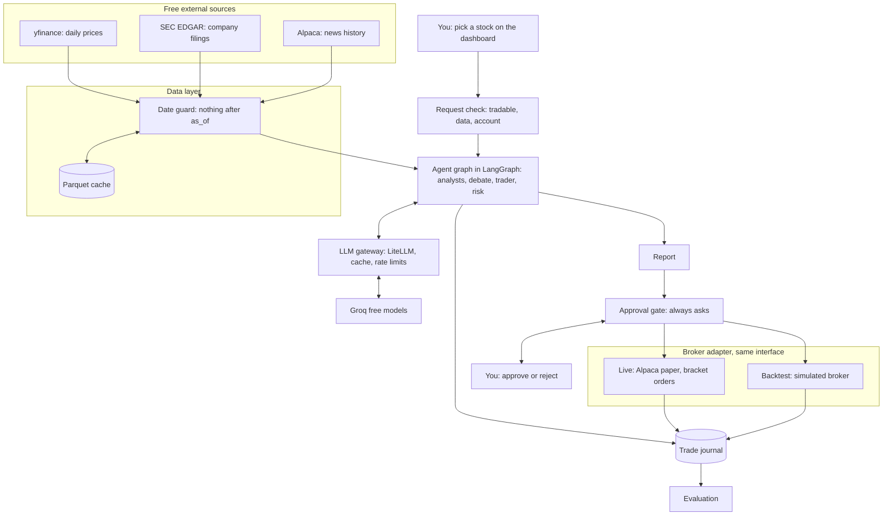
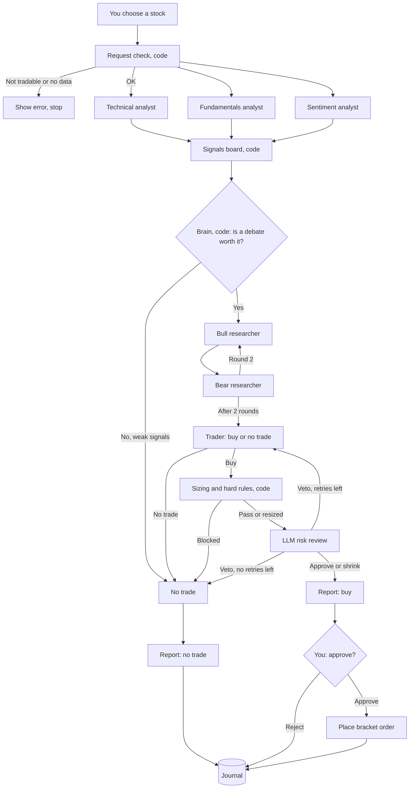
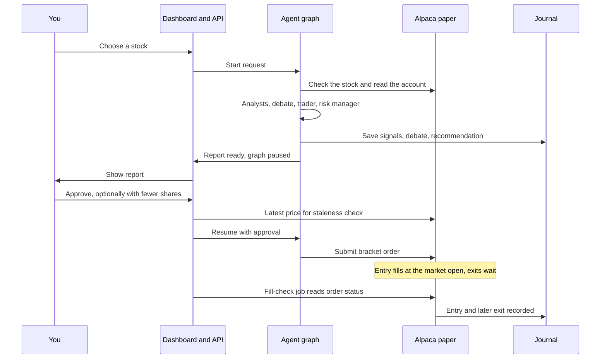
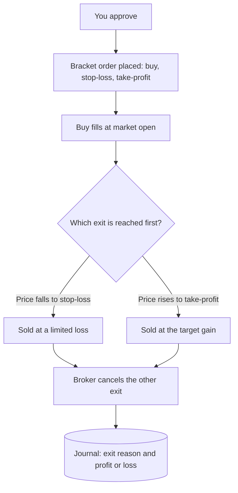
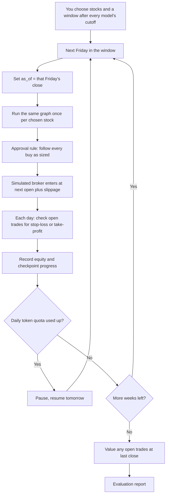

# Bull Pit v2: Architecture and Workflow

> You choose a stock. A team of AI agents studies it, argues both sides, and writes you a report with a clear recommendation. Nothing is traded until you say yes.

**The core idea: two agents argue, you decide.**

| Bull | Judge | Bear |
|---|---|---|
| Argues for buying, using evidence the analysts found. | You read the report and decide | Attacks that evidence and argues against the trade. |

---

## Revision history

| Version | Date | Change |
|---|---|---|
| v2.0 | — | Original design (`Bull Pit v2_ architecture and workflow.html`), converted to Markdown with full coverage. |
| v2.1 | 2026-09-28 | **D8:** the brain's debate-or-skip routing is done by code, not an LLM (Part 4, §19). **D9:** LLM models changed from Groq Llama 3.1 8B / 3.3 70B to Groq **gpt-oss-20b / gpt-oss-120b** (June 2024 training cutoff), so the backtest window now starts **2024-07-01 or later** (§10, §13, §14, §16, §17, §19). Free-tier budget rewritten for the new models' limits (§14). |
| v2.2 | 2026-09-28 | **D10:** the fundamentals LLM judges the filing-based ratios only; P/E, which moves with the daily price, is computed by code on every request and passed to the debate and report as evidence, so the per-filing cache can never reuse a verdict formed with a later price (Part 6). **D11:** code writes every evidence fact; the analyst LLMs judge direction and confidence (sentiment: per-headline scores) without writing numbers (Part 5). |
| v2.3 | 2026-09-29 | **M5:** the free-tier budget (§14) now uses tokens measured on real requests (about 15K per debated request against the earlier 25–30K estimate). No behaviour change. |
| v2.4 | 2026-09-29 | **D12:** the simulated broker checks stop-loss and take-profit on the entry day too, using that day's low and high, stop first (Part 14). **M6 done-when** (§16): a resumable backtest proven on the pinned models with a real pause and resume; the 26-week run moves to M7 because the free daily quota can't cover it in one day. |
| v2.5 | 2026-09-30 | **D13:** M7's AI runs use `qwen/qwen3.8-27b:free` on OpenRouter for both roles, over a window after its 2026-08-14 release (§12, §13); the pinned gpt-oss models stay the default. **M7 done-when** (§16): a pilot results table for all four approaches; repeat runs, the full 26-week run and debate impact are carried over. |

Implementation-level decisions that don't change the system's behaviour (deviations D1–D7) are recorded in [`dev-plan.md` §3](dev-plan.md#3-deviations-from-the-architecture-roadmap).

---

## Contents

1. [What changed in v2](#1-what-changed-in-v2)
2. [What it does](#2-what-it-does)
3. [Words you'll need](#3-words-youll-need)
4. [System overview](#4-system-overview)
5. [One request, step by step](#5-one-request-step-by-step)
6. [Every part in detail](#6-every-part-in-detail)
7. [The report](#7-the-report)
8. [Live mode](#8-live-mode)
9. [A trade's life](#9-a-trades-life)
10. [Backtest mode](#10-backtest-mode)
11. [Look-ahead protection](#11-look-ahead-protection)
12. [Evaluation](#12-evaluation)
13. [Tech stack](#13-tech-stack)
14. [Free-tier budget](#14-free-tier-budget)
15. [Project structure](#15-project-structure)
16. [Build roadmap](#16-build-roadmap)
17. [Risks and fixes](#17-risks-and-fixes)
18. [Interview talking points](#18-interview-talking-points)
19. [Summary](#19-summary)

---

## 1. What changed in v2

| Area | v1 | v2 |
|---|---|---|
| Who picks the stock | The brain agent, every week | You, whenever you want |
| How it runs | Scheduled weekly cycle | On demand, one stock per request |
| Existing holdings | Managed: reviewed every cycle, sold when needed | Not managed. Each request is independent and uses the money available in your account |
| Possible actions | Buy, sell, hold, resize | Buy or no trade (long only) |
| Approval | Only large or unusual trades | Every trade, no matter how small |
| Output | Trade journal | A readable report you decide from, plus the journal |
| Closing trades | Sell decisions in later cycles | Every buy carries its own stop-loss and take-profit, handled by the broker |

> **Why exits are attached to every buy.** Without holdings management, nothing would ever sell a position, and a trade that never closes can't be measured. So each buy is placed as a **bracket order**: the entry plus two exit orders (a stop-loss and a take-profit) that the broker handles on its own. The system opens trades and never has to watch them afterwards.

> **Why the system still looks at the account.** It never manages or sells what you hold, but the risk rules read your cash and any existing position in the chosen stock. Otherwise, picking the same stock three times could quietly put 30% of your money into it.

---

## 2. What it does

Bull Pit is a multi-agent AI system that works like a small research and trading desk for one stock at a time. Instead of one AI making the call, several specialised agents each do one job and check each other's work.

Every request goes through five stages:

1. **You choose a stock.** The system checks it's tradable and reads your available money.
2. **Analyse.** Three analyst agents study it at the same time: price trend, business numbers, and recent news.
3. **Debate.** A bull agent argues for buying and a bear agent argues against, for two rounds, citing the analysts' evidence.
4. **Recommend and check.** A trader agent recommends buy or no trade. Code sizes the trade and sets its exits. A risk manager checks everything and can shrink or veto.
5. **Report and ask.** You get a report with the recommendation and the reasons for it. If it says buy, you approve or reject. Only then is an order placed.

The same code runs in two modes:

| Mode | What "today" means | Who approves | Where trades go |
|---|---|---|---|
| Live | The latest market close | You, every time | Alpaca paper account (fake money, real prices) |
| Backtest | A simulated past date | A fixed rule: follow every recommendation | A simulated broker written in Python |

> **No real money, ever.** The code refuses to start unless it is connected to Alpaca's paper-trading endpoint. The report is a research tool, not financial advice.

---

## 3. Words you'll need

| Term | Meaning |
|---|---|
| Agent | An LLM given one role and one job, like "technical analyst". |
| Paper trading | Trading with fake money on a real broker's system, using real market prices. |
| Backtest | Replaying the past, week by week, to see how the recommendations would have performed. |
| Equity | Your account's total value: cash plus the current value of everything you hold. |
| Long only | The system only buys stocks expecting them to rise. It never bets on a fall (short selling). |
| Stop-loss | An order that sells automatically if the price falls to a set level, limiting the loss. |
| Take-profit | An order that sells automatically if the price rises to a set level, locking in the gain. |
| Bracket order | One buy order with a stop-loss and a take-profit attached. When one exit fills, the broker cancels the other. |
| ATR | Average True Range: the stock's typical daily price movement over the last 14 days. It is used to set exits that suit how jumpy the stock is. |
| Look-ahead bias | When a test accidentally uses information from after the simulated date. It makes results look better than reality. |
| Point-in-time data | Data exactly as it was known on a past date. |
| Training cutoff | The date after which an LLM has seen no data. |
| Signal | An analyst's verdict: direction, confidence from 0 to 1, and evidence. |
| Slippage | The gap between the price you expected and the price you actually got. |
| Sharpe ratio | Return divided by how bumpy the ride was. Higher is better. |
| Maximum drawdown | The worst fall from a peak to a later low. |
| Profit factor | Total money won on winning trades divided by total money lost on losing trades. Above 1 means the trades made money overall. |
| Idempotency | Making an action safe to repeat, so sending the same order twice by accident creates only one order. |
| Checkpointer | A LangGraph feature that saves the graph's state, so it can pause for your approval and resume later. |

---

## 4. System overview

You start every request from the dashboard. Data flows in through a date guard, the agent graph produces a report, and the graph pauses until you decide. An approved buy goes to whichever broker the current mode uses, and everything is written to the journal.



**One graph, two modes.** Only three pieces are swapped between live and backtest: the clock (`as_of`), the broker, and who approves. This pattern is called **dependency injection**: the core stays the same and different parts are plugged in. It proves the backtest tests the exact code that runs live.

---

## 5. One request, step by step



1. **You choose a stock** on the dashboard.
2. **Request check.** Code confirms the stock is tradable on Alpaca and has data, then reads your cash, equity, and any existing position in that stock.
3. **Three analysts, in parallel.** Each produces a signal with evidence IDs.
4. **Signals board.** Code validates and summarises the three signals.
5. **Debate or skip.** If every signal is weak, the brain skips the debate and the result is "no trade". Otherwise the bull and bear debate for two rounds.
6. **Trader.** Recommends buy or no trade, a target size, and an exit style.
7. **Risk manager.** Code calculates the share count, stop-loss, and take-profit, and applies hard rules. Then an LLM reviews it. A veto sends it back to the trader, at most twice.
8. **Report.** Always produced, for both "buy" and "no trade".
9. **You decide.** A buy waits for your approval every time. You can also lower the share count before approving.
10. **Execute and record.** An approved buy is placed as a bracket order. Everything is saved to the journal.

---

## 6. Every part in detail

Each part explains what it does, how it works inside, and what it hands to the next part. Numbers such as "10% per trade" are starting values you can tune.

**Legend:**

- `[LLM]` — an AI agent does the work
- `[Code]` — plain Python, no AI
- `[Both]` — code and an LLM share the work

### Part 0 — The backbone: shared state and graph `[Code]`

The system is one LangGraph graph. A **node** is one step, an **edge** is the arrow to the next step, and the **state** is one shared object every node reads and writes.

For each request, the state holds:

- `request_id`, `mode` (live or backtest), and `as_of` (the current date)
- `ticker`: the stock you chose
- `account`: cash, equity, and any existing position in this stock (read-only)
- `signals`, `debate`, `recommendation`, `sized_order`, `risk_verdict`
- `report` and `approval`

**Hands over:** a state object that flows through every other part.

### Part 1 — Request check `[Code]`

Runs first, before any LLM call, so a bad request costs nothing.

1. **Is the stock tradable?** Alpaca's asset lookup confirms it exists, is active, and can be traded.
2. **Is there enough data?** At least about 60 trading days of prices. Company filings are needed for the fundamentals analyst. ETFs have none, so v1 is limited to regular US company stocks.
3. **What's in the account?** Cash, equity, and the current value of any position you already hold in this stock. It is read, never changed.
4. **Is a request already running for this stock?** Duplicate requests are refused.

If any check fails, you see a clear message, such as "No SEC filings found for this ticker. Try a US company stock."

**Hands over:** a validated ticker and account snapshot.

### Part 2 — Data layer and date guard `[Code]`

This is the only door to the outside world. Agents never call yfinance or an API directly. They call tool functions from this layer.

Every tool takes an `as_of` date and protects it twice:

1. **Request filter:** it only asks the source for data up to `as_of`.
2. **Response check:** it drops any row dated after `as_of` and logs it.

Automated tests prove the guard works, for example: "with `as_of` = 7 June 2024, no returned row is dated later."

- **Prices:** daily open, high, low, close, and volume from yfinance, with Alpaca's price data as a backup.
- **Company filings:** SEC EDGAR's free companyfacts JSON. Every number has its **filing date**, which the guard filters on. The SEC asks for a User-Agent header with your email and about 10 requests per second at most, so files are downloaded once and stored.
- **News:** Alpaca's news endpoint (Benzinga articles, history back to 2015), with `end = as_of`.
- **Market context:** the S&P 500 (SPY) and the VIX volatility index (`^VIX`) from yfinance, for the report's market section.
- **Cache:** everything is saved as Parquet files on first fetch and read from disk afterwards.

**Hands over:** clean, date-filtered tables to the analyst tools.

### Part 3 — LLM gateway `[Code]`

Every LLM call goes through this one place, built on LiteLLM.

- **Model routing:** a small model for analysts and the report, a larger one for the debate, trader, and risk review.
- **Response cache:** keyed by model, prompt, temperature, and a run seed. Repeated calls cost zero tokens, and changing the seed forces fresh answers for repeat runs.
- **Rate limiter:** keeps calls under per-minute limits and retries after error 429 with a growing wait (exponential backoff).
- **JSON validation:** Pydantic checks every reply. An invalid reply is retried once with the error message, then replaced by a safe default and flagged.
- **Token logging:** records tokens for every call.
- **Pinned models in backtests:** no switching providers mid-backtest, because a different model has a different training cutoff.

**Hands over:** validated JSON replies to whichever agent called it.

### Part 4 — Brain (orchestrator) `[Code]`

In v2 you pick the stock, so the brain's job is routing within a request:

- **Debate or skip.** If all three signals are weak and neutral, it skips the debate and ends with "no trade", saving about five LLM calls. "Weak" is decided by code from the signals board's confidence-weighted score and agreement check, compared against thresholds set in config.
- **Data warnings.** If an analyst failed or had thin data (for example, no news this week), it adds a warning to the report so you know the recommendation rests on less evidence.

The brain makes **no LLM call** (changed in v2.1, D8). It can only choose between the defined routes, and the routing rule is deterministic and unit-testable.

**Hands over:** the route (debate or no trade) and any data warnings.

### Part 5 — Technical analyst `[Both]`

**Code** computes from price bars up to `as_of`:

- **SMA 20 and SMA 50:** average closing price over 20 and 50 days, and whether today's price is above them.
- **RSI 14:** a momentum score from 0 to 100. Above 70 is often called "overbought", below 30 "oversold".
- **ATR 14:** the typical daily price range. It is also used later to set the stop-loss and take-profit.
- **Volatility:** standard deviation of daily returns over 20 days × √252, as a yearly figure.
- **Returns** over 1 week, 1 month, and 3 months.

Code turns the numbers into short evidence facts, each with an ID. **The LLM** sees only those facts and judges the direction and confidence (v2.2, D11). All analysts share this format:

```json
{
  "ticker": "AAPL",
  "analyst": "technical",
  "direction": "bullish",
  "confidence": 0.6,
  "evidence": [
    {"id": "T1", "fact": "Close 182 is above SMA50 of 170"},
    {"id": "T2", "fact": "RSI 68, near the overbought zone"}
  ]
}
```

The LLM never calculated anything. Code guaranteed the numbers, and the LLM only judged what they mean. The evidence IDs are what the debate must cite.

**Hands over:** a technical signal (T-IDs), plus the ATR value for sizing.

### Part 6 — Fundamentals analyst `[Both]`

**Code** uses only SEC facts filed on or before `as_of` and computes revenue growth (this quarter against the same quarter last year), net profit margin (net income ÷ revenue), and the P/E ratio (price ÷ earnings per share over the last 4 quarters).

- **The missing Q4:** it's usually only in the annual 10-K report, so code calculates it as the annual total minus Q1 to Q3.
- **Different names for the same number:** revenue can appear under different XBRL tags depending on the company. A mapping list handles this and is tested on your stocks.

**The LLM** reads the filing-based ratios (revenue growth, net margin, earnings per share) and judges the signal. The P/E ratio moves with the daily price, so code computes it on every request and adds it to the signal's evidence for the debate and the report, but it isn't in the LLM's prompt (v2.2, D10). The prompt therefore changes only when a new report is filed, so the signal is cached by (ticker, latest filing date) without ever reusing a verdict formed with a later price.

**Hands over:** a fundamentals signal (F-IDs).

### Part 7 — News sentiment analyst `[Both]`

**Code** fetches news from the 7 days before `as_of`, removes near-duplicates, and keeps about 15 headlines. **The LLM** scores each from −1 to +1 and marks whether it's really about this company. **Code** combines the scores with a relevance-weighted average. No news gives a neutral signal with confidence 0.

**Hands over:** a sentiment signal (S-IDs).

### Part 8 — Signals board `[Code]`

Collects and validates the three signals. A failed analyst is replaced by a neutral signal at confidence 0 and flagged, so the request continues. It then computes whether the signals agree and a confidence-weighted score for the brain.

**Hands over:** a validated summary plus every evidence ID the debate may cite.

### Part 9 — Bull vs bear debate `[LLM]`

Both agents get the same signals board. The bull speaks first each round, and each turn is limited to about 150 words.

1. **Round 1:** the bull states its three strongest points; the bear rebuts each and adds counter-evidence.
2. **Round 2:** the bull answers the attacks; the bear gives its final response.

Both must cite evidence IDs, never invent numbers, and address the opponent's strongest point. Conceding a point is allowed. **Code check:** a claim citing an ID that doesn't exist is flagged "unsupported".

**Why the conflict helps:** a single LLM tends to lock onto one story (confirmation bias). A forced opposing case brings risks to the surface, and the report shows you both sides.

**Hands over:** the transcript, each side's final conviction, and the points the bull conceded.

### Part 10 — Trader `[LLM]`

Reads the debate, the signals summary, and the account snapshot, and replies:

```json
{
  "ticker": "AAPL",
  "action": "buy",
  "target_weight": 0.06,
  "exit_style": "normal",
  "confidence": 0.62,
  "decisive_evidence": ["T1", "F2"],
  "reasoning": "Trend and margins outweigh the news risk."
}
```

- `action` is either `buy` or `no_trade`.
- `target_weight` is the suggested size as a percentage of equity. The trader thinks in percentages; code converts to shares.
- `exit_style` is tight, normal, or wide (see the risk manager). The trader picks a style, never exact prices.

**Hands over:** a recommendation to the risk manager.

### Part 11 — Risk manager `[Both]`

#### Stage A: exits, sizing, and hard rules in code

**Exits from ATR.** Each style keeps the same reward-to-risk ratio of 1.5:

| Exit style | Stop-loss | Take-profit |
|---|---|---|
| Tight | Entry − 1.5 × ATR | Entry + 2.25 × ATR |
| Normal | Entry − 2 × ATR | Entry + 3 × ATR |
| Wide | Entry − 3 × ATR | Entry + 4.5 × ATR |

**Share count** is the smallest of four limits:

1. The trader's target weight.
2. **Risk per trade:** if the stop-loss is hit, you lose at most 1% of equity.
3. **Per-stock cap:** this stock, including any shares you already hold, stays under 10% of equity.
4. **Cash:** never more than your available cash. No borrowing.

**Example.** Equity is $100,000 and cash is $96,000. AAPL last closed at $182, and ATR is $4. The trader chose "normal" and 6%.

- Stop-loss = 182 − 2 × 4 = **$174**. Take-profit = 182 + 3 × 4 = **$194**. Risk per share = $8.
- Limit 1, target: 6% of $100,000 = $6,000 → 32 shares.
- Limit 2, risk: 1% of equity = $1,000 ÷ $8 → 125 shares.
- Limit 3, cap: 10% = $10,000 → 54 shares (with nothing already held).
- Limit 4, cash: $96,000 → 527 shares.
- Final: **32 shares** (about $5,824). If the stop-loss is hit, you lose about $256. If the take-profit is hit, you gain about $384.

This example works because each limit protects against a different danger: the trader's judgment, one bad trade, too much in one stock, and spending money you don't have. The smallest one wins, so all four are always respected.

**Loss warning:** if equity fell more than 5% in the last 7 days, the report shows a red warning, and approving requires an extra confirmation.

#### Stage B: LLM review

Runs only if Stage A passes. It looks for things rules can't see, such as a serious bear point the trader ignored, or a size that doesn't match weak confidence. It can approve, shrink, or veto, with a reason. Code makes sure it can only shrink, never enlarge. A veto sends the recommendation back to the trader, at most twice, then the result is "no trade".

**Hands over:** a sized order with its stop-loss and take-profit, or "no trade" with the reason.

### Part 12 — Report generator `[Both]`

Produces the report you decide from (see [The report](#7-the-report) for the full layout).

- **Code fills in every number:** prices, signals, share count, dollar amounts, exits, the maximum loss and possible gain, and market context.
- **The LLM writes only the plain-language parts:** a short summary, the strongest point on each side, and what would change the view. It may only refer to numbers already in the report. A code check rejects any new number it tries to add.
- A report is produced for **every** request, including "no trade", so you always see why.

**Hands over:** the report to the approval gate and the journal.

### Part 13 — Approval gate `[Code]`

**Every buy needs your approval, no matter how small.** Nothing is ever traded automatically.

1. LangGraph's `interrupt()` pauses the graph, and the checkpointer saves its state.
2. The dashboard shows the report with **Approve** and **Reject** buttons. You may lower the share count first. Raising it is not allowed, and code re-checks the rules on any change.
3. **Staleness check:** when you click Approve, code fetches the latest price. If it moved more than 2% since the report, you're told and asked to confirm again or re-run the analysis.
4. **Expiry:** an unanswered report expires after one trading day, because its prices are out of date.

**In backtest mode** no one can be asked, so a fixed rule applies: every "buy" recommendation is approved as sized. That measures the quality of the recommendations themselves.

**Hands over:** an approved order to the broker, or a rejection to the journal.

### Part 14 — Execution: broker adapter `[Code]`

Both brokers are classes with the same functions (`get_account`, `get_position`, `submit_bracket_order`, `get_order`), so the graph never knows which one it is using.

#### Alpaca paper broker (live)

- Confirms the endpoint is `paper-api.alpaca.markets` at startup, and refuses to run otherwise.
- Places a **bracket order**: a market buy plus a stop-loss and a take-profit. The two exits stay active until one fills, and the broker then cancels the other. Uses whole shares, since advanced order types may not support fractional shares. Check Alpaca's current bracket-order rules while building.
- Orders placed while the market is closed wait for the next open.
- Every order has a unique `client_order_id` built from the request ID, so a retry can't create a duplicate.
- A **fill-check job** (run on a schedule or when you open the dashboard) reads order status and records entries and exits in the journal. It only records; it never changes a trade.

#### Simulated broker (backtest)

- Enters at the **next trading day's open**, worsened by 0.05% slippage.
- On the entry day and each later day, it checks that day's low and high. If the low reaches the stop-loss, the trade exits at the stop price. If the high reaches the take-profit, it exits there. If both happen on the same day, it assumes the stop-loss came first. This is the cautious choice, because daily data can't tell the real order.
- If the price opens past an exit level (a gap), it exits at the open price, which is worse, as it would in reality.
- Trades still open when the backtest window ends are valued at the last close and reported separately.

**Hands over:** entry and exit fills to the journal.

### Part 15 — Trade journal `[Code]`

A database (SQLite locally, or Supabase's free Postgres tier if hosted).

| Table | Holds |
|---|---|
| `requests` | Ticker, mode, `as_of`, models used, config, git commit |
| `signals` | The three analyst outputs with evidence |
| `debate_turns` | Every bull and bear turn, with unsupported claims flagged |
| `recommendations` | Trader output, risk verdicts, vetoes, final sized order |
| `reports` | The full report as shown to you |
| `approvals` | Approve or reject, any share changes, timestamps |
| `trades` | Entry, exit, exit reason (stop, target, or window end), profit or loss |
| `equity_snapshots` | Account value over time |
| `llm_calls` | Model, tokens, latency, cache key for every call |

**Hands over:** a complete history for the dashboard and the evaluation.

### Part 16 — Evaluation `[Code]`

Reads the journal and compares Bull Pit's recommendations against baselines. The full method is in [Evaluation](#12-evaluation).

**Hands over:** a results report with metrics, charts, and honest conclusions.

---

## 7. The report

The report is what you read before deciding. It is built so you can understand the recommendation in a few seconds, then check every reason behind it.

### Sections, in order

1. **Header:** ticker, company name, report time, and the date of the price data used.
2. **Recommendation:** buy or no trade, confidence, and one sentence explaining why.
3. **Suggested order** (buy only): shares, dollar amount, percentage of equity, stop-loss, take-profit, the maximum loss if the stop is hit, and the gain if the target is hit.
4. **What the analysts found:** the three signals in a table, with their evidence.
5. **The debate:** the strongest bull point, the strongest bear point, what the bull conceded, and anything left unresolved.
6. **Risk manager:** which limit set the share count, any shrink or veto and its reason, and any warnings.
7. **What would change the view:** for example, "a close below $174 invalidates the trend argument."
8. **Market context:** whether the S&P 500 is above or below its 200-day average, and whether the VIX is high or low, with one line on what that means.
9. **Data notes:** models used, number of news articles, latest filing date, and any data warnings.
10. **Actions** (buy only): editable share count, Approve, and Reject.

### Example (made-up numbers)

*Example report card for AAPL recommending a buy of 32 shares.*

> #### AAPL, Apple Inc. — `Buy`
>
> **Confidence 0.62.** The uptrend and strong margins outweigh short-term news risk.
>
> | | |
> |---|---|
> | Suggested order | 32 shares, about $5,824 (5.8% of equity) |
> | Stop-loss | $174, maximum loss about $256 |
> | Take-profit | $194, possible gain about $384 |
> | Size set by | Trader's 6% target (smallest of the four limits) |
> | Signals | Technical bullish 0.6, fundamentals neutral 0.4, sentiment bearish 0.5 |
> | Strongest bull point | Price is above both averages with steady margins (T1, F2) |
> | Strongest bear point | A regulatory headline could reverse the trend (S1) |
> | Would change the view | A close below $174 |
>
> `[ 32 shares ]` `[ Approve ]` `[ Reject ]`

---

## 8. Live mode

Live mode runs whenever you start a request. There is no schedule for decisions. The US market is open 6:30 pm to 1:00 am in Pakistan (7:30 pm to 2:00 am when the US is on winter time). Orders approved while the market is closed wait for the next open.



---

## 9. A trade's life

Once you approve, the system never touches the trade again. The broker handles the exits, and the fill-check job only records what happened.



You can still close any position yourself from the Alpaca dashboard at any time. The system simply records it on the next fill check.

---

## 10. Backtest mode

Backtest mode asks: "If I had requested a report on this stock every Friday, and followed every recommendation, how would it have gone?"



- **Independent requests:** each Friday is treated as a fresh request, exactly like live mode. Open trades from earlier weeks are never managed; their brackets simply run.
- **Shared account:** all trades draw from one simulated account, so cash and the per-stock cap work as they do live. A request finding too little cash gets a smaller trade or "no trade".
- **Window:** starts after the training cutoff of every model used. The pinned Groq models (gpt-oss-20b and gpt-oss-120b) have a June 2024 cutoff, so the window starts on **2024-07-01 or later**. The backtest runner refuses an earlier start.
- **Choosing stocks fairly:** pick them with a rule that uses only information from the start date, such as the largest company in each of five sectors on day one. Picking stocks you already know did well is survivorship bias.
- **Resumable:** progress is saved after every simulated week, so free-tier limits pause the run instead of breaking it.
- **Suggested first run:** 3 stocks, weekly, 26 weeks.

---

## 11. Look-ahead protection

Look-ahead bias lets a test "see the future" and look better than reality. Bull Pit guards against two kinds.

| | Kind 1: leaky data | Kind 2: leaky memory |
|---|---|---|
| What it is | Tools return data dated after `as_of` | The LLM remembers from training what happened after `as_of` |
| Example | Using a report on 1 April that was filed on 5 May | Testing 2023 while the model "knows" a stock rallied that year |
| Fix | Date guard with tests, SEC filing dates, next-open entries, cautious same-day exit rule | Only backtest dates after every model's training cutoff |

> ⚠️ **Why Kind 2 matters.** Research has shown LLMs can recall historical prices and outcomes from before their training cutoff, and telling them to "ignore the future" does not stop it. A tools-only date guard is not enough.

Live requests are automatically free of both kinds, since no model can remember the future. Your live track record is your cleanest evidence.

---

## 12. Evaluation

The question: **are Bull Pit's recommendations better than a single agent or a simple rule, and at what cost?** An honest "the debate added cost but no clear gain" is still a strong result.

### Metrics

| Metric | How it's calculated | What it tells you |
|---|---|---|
| Total return | End equity ÷ start equity − 1 | How much money it made |
| Sharpe ratio | (Average weekly return ÷ standard deviation of weekly returns) × √52, risk-free rate taken as 0 | Return for the risk taken |
| Maximum drawdown | Largest (peak − value) ÷ peak over the equity curve | The most painful fall |
| Win rate | Share of closed trades that made money | How often buys worked |
| Profit factor | Total gains ÷ total losses on closed trades | Whether wins outweigh losses |
| "No trade" value | What the same trade would have done on weeks the system said no trade | Whether saying no avoided losses |
| Calibration (Brier score) | Average squared gap between confidence and outcome (1 if the trade won, 0 if not); lower is better | Whether confidence scores are honest |
| Tokens per request | From the `llm_calls` table | What each approach costs |
| Debate impact | How often the debate changed the trader's decision | Whether the debate does anything |

### Baselines

All baselines use the same stocks, dates, sizing rules, exit rules, and slippage, so only the buy decision differs.

1. **Always buy:** buys every week. It shows whether Bull Pit's "no trade" decisions add value.
2. **Moving-average rule (no LLM):** buys only when the price is above its 50-day average.
3. **Single agent:** one LLM call sees all three analysts' data and outputs the same recommendation format, using the same model.
4. **Bull Pit:** the full multi-agent system.

Plus **buy and hold** for each stock over the window, as a market reference.

**Repeat runs:** each LLM setup runs at least 3 times with fresh seeds, and results are reported as an average with a range. *(D13: the M7 pilot has one run per approach, on a model that takes no seed; the repeats, the full 26-week run and the debate-impact metric are carried over.)*

> **Limits to state in the report:** a few stocks over a few months is a small sample, so differences may be luck. Paper and simulated fills approximate real execution.

---

## 13. Tech stack

Everything is free. Nothing needs a GPU, so it runs on an 8 GB RAM laptop.

| Layer | Tool | Why this one |
|---|---|---|
| Language | Python 3.11+ | Every library below is Python |
| Agent orchestration | LangGraph | Graph of nodes, parallel analysts, pause for approval (`interrupt`), saved state (checkpointer) |
| LLM access | LiteLLM | One interface for all providers |
| LLM models | *(M7's AI runs only, D13: `qwen/qwen3.8-27b:free` on OpenRouter for both roles.)* Groq free tier, pinned: `openai/gpt-oss-20b` (small: analysts, sentiment scoring, report) and `openai/gpt-oss-120b` (large: debate, trader, risk review) | Fast, free, open-weight, published June 2024 training cutoff |
| Structured output | Pydantic v2 | Validates every agent reply |
| Data processing | pandas, NumPy | Indicators, ATR, ratios, sizing in plain, testable code |
| Prices and market context | yfinance (Alpaca market data as backup) | Free daily history, SPY and VIX |
| Fundamentals | SEC EDGAR companyfacts via httpx | Free, with filing dates for point-in-time use |
| News and trading | alpaca-py (news API, paper trading, bracket orders) | Free historical news and a fake-money account |
| Data cache | Parquet (pyarrow) | Fast, repeatable runs |
| Database | SQLite locally; Supabase Postgres (free) if hosted | Journal and LangGraph checkpoints |
| Backend API | FastAPI | Start requests, serve reports, receive approvals |
| Dashboard | Next.js with Recharts | Pick a stock, read reports, approve, view trades and results |
| Tracing | Langfuse (free tier or self-hosted) | See every agent call and its tokens |
| Testing | pytest | Date guard, indicators, sizing, rules, simulated exits |
| CI | GitHub Actions | Runs tests on every push |
| Secrets | python-dotenv, `.env` in `.gitignore` | Keeps API keys out of the public repo |

---

## 14. Free-tier budget

Groq's published free-tier limits, checked on 2026-09-28, are the same for both pinned models. Each model has its own separate quota:

| Model | Requests per minute | Requests per day | Tokens per minute | Tokens per day |
|---|---|---|---|---|
| `openai/gpt-oss-20b` (small) | 30 | 1K | 8K | 200K |
| `openai/gpt-oss-120b` (large) | 30 | 1K | 8K | 200K |

Check Groq's rate-limit page before relying on these, since they change.

Measured on real runs (M5, 2026-09-29; input + output + reasoning, from `llm_calls`, a cached call counted at the tokens of its original call):

| Step | Calls | Model | Measured tokens |
|---|---|---|---|
| Analysts | 3 | small | ~2K |
| Debate | 4 | large | ~7K |
| Trader and risk review | 2 (1 if the trader says no trade) | large | ~2.4K for the trader, ~1.3K for the review |
| Report text | 1 (2 with a retry) | small | ~2.5–2.7K |
| **Total, debated request** | **9–10** | | **~15K** (about 10–11K large, about 4.5–7K small) |
| **Total, weak signals (no debate)** | **4** | | **~2.8K** (all small) |

- **Reasoning tokens.** Both gpt-oss models are reasoning models. Their hidden reasoning tokens count against the quota, on top of the estimates above. The gateway sets the lowest reasoning effort that gives valid output, and M2 measures the real cost.
- **Per-call ceiling.** With an 8K tokens-per-minute limit, any single call larger than about 8K tokens (input, reasoning and output together) can never succeed. Every prompt is kept compact, and the gateway rejects a call that would go over the ceiling before sending it.
- **Per-minute pacing.** A full request uses about three minutes of the large model's per-minute allowance, so a request takes a few minutes end to end. That's fine for on-demand use.
- **Live:** the large model's daily quota is the binding limit. At about 11K large-model tokens per debated request it allows roughly 18 full requests per day, so plan on about 12 to 15 once retries and re-runs are counted. That's plenty for personal use.
- **Backtest:** 3 stocks × 26 weeks is about 78 requests, or about 860K large-model tokens: roughly 5 days of quota for one full run, fewer where weak signals skip the debate. Moving every role onto the small model doesn't help, because both models have the same daily limit. Develop against recorded fixtures and the response cache, use short windows while debugging, and save full-length runs for results.
- Skipping weak debates, caching fundamentals, short JSON outputs, and 150-word debate turns all reduce usage.
- These are estimates. Measure real token counts early (M2) and re-plan.

---

## 15. Project structure

```text
bull-pit/
├── bullpit/
│   ├── config.py            settings, limits, model routing
│   ├── state.py             the shared graph state
│   ├── graph.py             builds the LangGraph graph
│   ├── request_check.py     tradable, data, account snapshot
│   ├── agents/              brain, technical, fundamentals, sentiment,
│   │                        bull, bear, trader, risk_review, single_agent
│   ├── tools/               indicators and ATR, fundamentals math, sentiment averaging
│   ├── data/                guard, prices, sec, news, market_context, cache
│   ├── llm/                 gateway, schemas, prompts/
│   ├── risk/                exits, sizing, rules
│   ├── report/              builder, number check, templates
│   ├── approval/            gate, staleness check, expiry
│   ├── broker/              base, sim (with bracket exits), alpaca
│   ├── journal/             database models and queries
│   ├── eval/                metrics, baselines, results report
│   └── runners/             request (live), backtest, fill_check
├── api/                     FastAPI app
├── web/                     Next.js dashboard
├── tests/                   guard, indicators, sizing, rules, sim exits
├── data_cache/              Parquet files (git-ignored)
├── .env.example             variable names without real keys
└── README.md                setup, design, results
```

---

## 16. Build roadmap

| Milestone | Build | Done when |
|---|---|---|
| M0 | Alpaca paper account and API keys | A test order placed from code fills and can be read back |
| M1 | Data layer, date guard, cache | Tests prove no data after `as_of` leaks |
| M2 | LLM gateway | Routing, cache, retries, validation, token logging work; real token counts measured |
| M3 | Request check, three analysts, signals board, brain routing | Valid signals for any stock on any past date |
| M4 | Debate, trader, risk manager with sizing and exits | A complete sized recommendation with stop-loss and take-profit |
| M5 | Report generator | A readable report for both "buy" and "no trade" |
| M6 | Simulated broker with bracket exits, journal, backtest runner | A resumable backtest runs on the pinned models, paused and resumed for real (the 26-week run is M7's headline run) |
| M7 | Evaluation and baselines | A pilot results table for all four approaches (2 stocks × 2 weeks, one seed, Qwen); repeat runs, the full run and debate impact are carried over (D13) |
| M8 | Live mode: dashboard request, approval, bracket orders, fill check | One live request is approved, fills, and later exits, all recorded |
| M9 | Dashboard polish and README | A stranger can understand the system and its results from the repo |

---

## 17. Risks and fixes

| Risk | What could happen | Fix |
|---|---|---|
| LLM memory leak | Backtest looks smarter than it is | Post-cutoff window, pinned models |
| Free quota limits | Backtests take days | Fixtures and response cache for development, short debug windows, resumable runs |
| Stale report | You approve at an old price | 2% staleness check and one-day expiry |
| Same stock chosen repeatedly | Too much money in one stock | Per-stock cap counts existing shares |
| Trades never close | Results can't be measured | Every buy is a bracket order |
| Hallucinated numbers | Report shows invented facts | Numbers only from code; evidence ID and number checks |
| Agents agree too fast | Debate adds nothing | Evidence-citing rules; measure debate impact |
| yfinance breaks | No price data | Parquet cache; Alpaca data as backup |
| SEC tag differences | Wrong ratios | Tag mapping list, tested per stock |
| Duplicate orders | Buying twice after a network error | Unique `client_order_id` |
| Leaked API keys | Someone uses your account | `.env` in `.gitignore` |

---

## 18. Interview talking points

- **Justified multi-agent design:** real parallelism (three analysts at once) and real role conflict (bull against bear).
- **Human in the loop by design:** the AI researches and recommends; a person approves every trade, with pause and resume built on LangGraph checkpoints.
- **Code for math, LLMs for judgment:** sizing, exits, and hard rules are code, and the report's numbers can't be invented by an LLM.
- **Professional risk sizing:** share count is the smallest of four limits, including a 1% maximum loss per trade.
- **Two kinds of look-ahead bias handled:** leaky data and leaky model memory.
- **Same code in both modes:** the broker adapter means the backtest tests exactly what runs live.
- **Honest evaluation:** fair baselines with identical exits, repeat runs, calibration, and cost per request.

---

## 19. Summary

| Part | Who does it | Hands over |
|---|---|---|
| Request check | Code | Valid ticker, account snapshot |
| Data layer and date guard | Code | Date-filtered data |
| LLM gateway | Code | Validated, cached replies |
| Brain | Code | Debate or no trade; data warnings |
| Technical analyst | Code math, LLM reading | Signal (T-IDs) and ATR |
| Fundamentals analyst | Code math, LLM reading | Signal (F-IDs) |
| Sentiment analyst | LLM scoring, code averaging | Signal (S-IDs) |
| Signals board | Code | Validated summary |
| Bull vs bear debate | Two LLMs, code ID checks | Transcript, concessions |
| Trader | LLM | Buy or no trade, size, exit style |
| Risk manager | Code sizing and rules, then LLM | Sized bracket order or no trade |
| Report generator | Code numbers, LLM wording | The report you decide from |
| Approval gate | Code, and you | Approved order or rejection |
| Broker adapter | Code | Entry and exit fills |
| Trade journal | Database | Full history |
| Evaluation | Code | Metrics against baselines |

### Key takeaways

- [ ] You choose the stock; each request is independent and sized against the money in your account.
- [ ] The system never manages or sells holdings. Every buy carries its own stop-loss and take-profit, handled by the broker.
- [ ] Every trade needs your approval, however small, with a staleness check and a one-day expiry.
- [ ] Every request produces a report, including "no trade", so you always see why.
- [ ] Share count is the smallest of four limits: trader target, 1% risk, 10% per-stock cap, and available cash.
- [ ] Code does all math and every number in the report; LLMs only interpret, argue, and explain.
- [ ] Live trades go to the Alpaca paper account; backtest trades go to the simulated broker, which follows every recommendation.
- [ ] Look-ahead protection covers leaky data (date guard) and leaky memory (post-cutoff window).
- [ ] Evaluation compares Bull Pit with always-buy, a moving-average rule, and a single agent, all using identical exits.
- [ ] Everything is free; the LLM quota is the main constraint, handled with fixture-based development, caching, and resumable backtests.

---

*Bull Pit v2 architecture and workflow. Paper trading and simulation only; no real money is used. Reports are research, not financial advice.*
