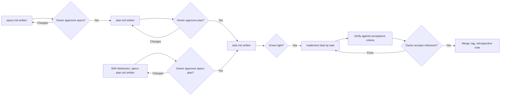
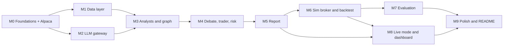

# Bull Pit v2 — Development Plan

| | |
|---|---|
| **Status** | Revision 4: all decisions resolved; M0 in progress |
| **Date** | 2026-09-28 |
| **Changes in revision 4** | Scope review of M1–M9 ([§10.1](#101-scope-review-revision-4)): work that doesn't change the architecture cut or simplified (C1–C13); token measurement, the pinned-model guard and the loss-warning wiring moved to the milestones that can actually do them (C14–C16). `architecture.md` unchanged |
| **Changes in revision 3** | Testing cut to what's necessary (§7 rewritten; CI on Ubuntu only; coverage targets, contract and golden tests removed); Q8a, Q10a, Q11 decided; D8 reviewed and kept |
| **Changes in revision 2** | Owner decisions recorded (§10); D1–D7 approved; D8 and D9 added (§3); `pandas_market_calendars` chosen (D2); S/M milestones use a combined `specs-plan.md` (§1.2); model swap to gpt-oss reflected in M0, M2, M6, M7 and the risks |
| **Source of truth** | [`docs/architecture.md`](architecture.md) |
| **Scope** | All milestones M0–M9, from an empty repo to a documented, evaluated, working system |

This plan explains **how** the system in `architecture.md` gets built: the engineering standards, the order of work, what each milestone delivers, how each one is tested and accepted, and which decisions still need to be made. It doesn't restate the architecture. When they disagree, `architecture.md` wins unless this plan points out a deviation and the reviewer accepts it (see [§3](#3-deviations-from-the-architecture-roadmap)).

---

## Contents

1. [How we work](#1-how-we-work)
2. [Engineering standards](#2-engineering-standards)
3. [Deviations from the architecture roadmap](#3-deviations-from-the-architecture-roadmap)
4. [Milestone overview and dependencies](#4-milestone-overview-and-dependencies)
5. [Milestones in detail (M0–M9)](#5-milestones-in-detail)
6. [Cross-cutting concerns](#6-cross-cutting-concerns)
7. [Testing strategy](#7-testing-strategy)
8. [Data model evolution](#8-data-model-evolution)
9. [Plan-level risks](#9-plan-level-risks)
10. [Decisions log](#10-decisions-log)
11. [Glossary of plan terms](#11-glossary-of-plan-terms)

---

## 1. How we work

### 1.1 Milestone lifecycle

Each milestone goes through the same gated lifecycle. Nothing moves to the next gate without explicit approval from the project owner. For milestones sized **S or M**, the specs and plan gates are one gate (a single `specs-plan.md`, see §1.2).



### 1.2 Per-milestone documents

Each milestone lives in `docs/milestones/M<n>-<slug>/`. Which documents it has depends on its size ([§4](#4-milestone-overview-and-dependencies)):

| Size | Documents |
|---|---|
| **S or M** (M0, M2, M5, M7, M9) | `specs-plan.md` (the contents of `specs.md` followed by the contents of `plan.md`, in one file) + `task.md` |
| **L or XL** (M1, M3, M4, M6, M8) | `specs.md` + `plan.md` + `task.md` |

If a milestone's size changes during review, its document set changes with it.

What each document holds:

| File | Answers | Contents |
|---|---|---|
| `specs.md` | **What** and **why** | Goal, scope in and out, functional requirements (numbered `M<n>-FR-x`), non-functional requirements (`M<n>-NFR-x`), interfaces and schemas, acceptance criteria (`M<n>-AC-x`, each testable), open questions |
| `plan.md` | **How** | Module design, key algorithms, data flow, library choices, error handling, test plan mapped to each AC, risks, references to ADRs |
| `task.md` | **In what order** | Ordered checklist of tasks (`M<n>-T-x`). Each task is small (about half a day or less) and lists the files it touches, the AC it serves, and how it's verified. Checked off as it's done, with the commit hash |

Every acceptance criterion traces to an automated test **or** a recorded manual check (most are manual; see [§7](#7-testing-strategy)), and every task traces to at least one acceptance criterion.

### 1.3 Architecture Decision Records (ADRs)

Any decision that isn't already fixed by `architecture.md`, or that changes it, gets a short ADR in `docs/adr/NNNN-title.md` (Context, Decision, Consequences, Status). Examples expected early: package manager, exit anchoring, bracket order time-in-force, and database access layer.

### 1.4 Definition of Ready (a milestone may start when)

- Its documents (`specs.md` + `plan.md`, or `specs-plan.md`, plus `task.md`) are approved.
- Every dependency milestone has been accepted.
- Every external account or key the milestone needs exists.
- The open questions in `specs.md` are answered, or explicitly deferred with a default.

### 1.5 Definition of Done (a milestone is accepted when)

- Every acceptance criterion passes, with its evidence linked in `task.md`.
- The tests required by [§7](#7-testing-strategy) for this milestone exist and pass locally and in CI.
- Lint, format and type checks are clean.
- No secrets are in the repo, and `.env.example` lists every new variable.
- Docs are updated: README section, any new ADRs, and `architecture.md` if an approved deviation changed it.
- The milestone branch is merged and tagged `m<n>`.
- A short retrospective is written in `task.md` (what changed from the plan, measured numbers, carry-overs).

### 1.6 Version control workflow

- **Branches:** `master` is always green. Each milestone gets its own branch, `m<n>-<slug>`, and bigger tasks may get sub-branches.
- **Commits:** Conventional Commits (`feat:`, `fix:`, `test:`, `docs:`, `refactor:`, `chore:`), with the task ID in the body (`Task: M1-T-4`).
- **Merge:** squash or merge commit into `master` after acceptance, then tag `m<n>`.
- **Default branch:** `master`. The local repo already exists on `master`, and the decision (Q7) was to keep it in that case.
- **Remote:** a **public** GitHub repository from day one (Q2). Public repos get free GitHub Actions minutes with no monthly cap, including Windows runners. Secret scanning (pre-commit and CI) is in place before the first push.

---

## 2. Engineering standards

### 2.1 Toolchain

| Concern | Choice | Notes |
|---|---|---|
| Python | 3.11+ (target 3.12) | As in the architecture |
| Package and env management | `uv` | Lockfile (`uv.lock`) committed; reproducible installs on Windows and in CI (ADR-0001) |
| Project metadata | `pyproject.toml` | Single source of truth for dependencies and tool config |
| Lint and format | `ruff` (lint + format) | Replaces black, isort and flake8 |
| Type checking | `mypy` | `strict` for `bullpit/risk`, `bullpit/data`, `bullpit/broker`, `bullpit/tools`, `bullpit/eval`; standard elsewhere |
| Tests | `pytest`, `hypothesis` | Hypothesis only for the two property tests in §7.1 (date guard, sizing limits) |
| Pre-commit | `pre-commit` | ruff, mypy (fast subset), secret scan, end-of-file and whitespace fixers |
| Secret scanning | `detect-secrets` or `gitleaks` in pre-commit and CI | Backs up the architecture's "`.env` in `.gitignore`" rule |
| CLI | `typer` | `bullpit request`, `bullpit backtest`, `bullpit eval`, `bullpit fill-check`, `bullpit doctor` |
| Settings | `pydantic-settings` | Typed config loaded from `.env` and the environment; every tunable limit lives in `config.py` |
| Logging | `structlog` (JSON in files, readable on the console) | Every log line carries `request_id`, `mode`, `as_of` when known |
| Database access | SQLAlchemy 2.0 + Alembic | Versioned migrations; SQLite locally, Postgres-compatible (ADR) |
| Frontend (M8) | Next.js (TypeScript, App Router) + Recharts | API types generated from FastAPI's OpenAPI schema |
| CI | GitHub Actions | Lint, type check, tests on every push and PR; web build from M8 |

Library versions are pinned in the lockfile. LangGraph, LiteLLM and alpaca-py change quickly, so they're upgraded only on purpose, one at a time, with the test suite as the gate.

### 2.2 Code conventions

- **Code for math, LLMs for judgment.** This is the architecture's main rule, enforced in review: no LLM output is ever used as a number unless it was validated and bounded by code (`target_weight`, `confidence`).
- **Pure core, thin edges.** Indicators, fundamentals math, sizing, exits, rules, the simulated broker's fill logic and metrics are pure functions over plain data. I/O lives only in `data/`, `llm/`, `broker/`, `journal/` and `api/`.
- **Everything time-aware takes `as_of`.** No code calls `datetime.now()` or `date.today()` outside a single `Clock` object that's injected. Live mode uses a real clock; backtest uses a simulated one.
- **Money handling.** Prices and dollar amounts use `Decimal` in sizing, exits, broker and journal code, and are rounded to cents at broker boundaries. Share counts are integers. Indicator maths may use floats (NumPy); values are converted at the boundary into sizing.
- **Typed contracts between nodes.** Every piece of state that crosses a graph node is a Pydantic model. No loose dicts in the state.
- **Errors.** One domain exception hierarchy (`BullPitError` → `DataUnavailable`, `LookaheadViolation`, `QuotaExhausted`, `BrokerRejected`, `ValidationFailed`, …). A failure in one analyst never crashes a request (Part 8). A failure in the broker or the date guard always stops loudly.
- **No magic numbers.** Every threshold in the architecture (1% risk, 10% cap, 2% staleness, 5% loss warning, 60 trading days, 150 words, 2 rounds, 2 vetoes, 0.05% slippage, ATR multipliers, 15 headlines, 7-day news window) is a named setting in `config.py`, and its default equals the architecture's value.

### 2.3 Repository layout

This follows [architecture §15](architecture.md#15-project-structure), with the additions marked ➕:

```text
bull-pit/
├── bullpit/
│   ├── config.py
│   ├── clock.py            ➕ injected Clock (live vs simulated), trading calendar access
│   ├── domain.py           ➕ non-LLM domain types: Account, Position, SizedOrder, Fill, Trade
│   ├── errors.py           ➕ domain exception hierarchy
│   ├── logging.py          ➕ structlog setup
│   ├── cli.py              ➕ typer entry points
│   ├── state.py
│   ├── graph.py
│   ├── request_check.py
│   ├── agents/
│   ├── tools/
│   ├── data/               (+ calendar.py ➕)
│   ├── llm/                (gateway, schemas, prompts/)
│   ├── risk/
│   ├── report/
│   ├── approval/
│   ├── broker/
│   ├── journal/            (+ migrations/ ➕ Alembic)
│   ├── eval/
│   └── runners/
├── api/
├── web/
├── tests/
│   ├── …                   test files mirror the package (tests/risk/, tests/data/, …)
│   └── fixtures/           ➕ (recorded API responses, small Parquet samples)
├── docs/
│   ├── architecture.md
│   ├── dev-plan.md
│   ├── adr/                ➕
│   └── milestones/         ➕ M0-…/specs.md, plan.md, task.md
├── data_cache/             (git-ignored)
├── .github/workflows/      ➕
├── .env.example
├── pyproject.toml          ➕
├── uv.lock                 ➕
└── README.md
```

---

## 3. Deviations from the architecture roadmap

The architecture's M0–M9 order is kept. Carrying it out properly needs a few pieces to arrive **earlier** than the architecture roadmap implies, because later milestones depend on them (D1–D7). None of these change the system's behaviour. D8 and D9 **do** change the architecture, and `architecture.md` v2.1 has been updated to match.

**Status: D1–D9 approved by the owner on 2026-09-28.**

| # | Deviation | Reason |
|---|---|---|
| D1 | **M0 grows from "Alpaca paper account" to "Foundations + Alpaca paper"**: repo scaffold, toolchain, CI, config, secrets, logging, plus an **external-services verification spike** | Every later milestone needs the toolchain. The spike checks, as of today, assumptions the architecture made "at the time of writing" (Groq models and limits, Alpaca news access, bracket order rules) before code depends on them |
| D2 | **Trading calendar in M1** (not named in the architecture), using **`pandas_market_calendars`** | Needed by the date guard ("60 trading days"), backtest Fridays (M6), report expiry "after one trading day" (M8), and next-open entries (M6). `pandas_market_calendars` works offline, so it's testable with no network |
| D3 | **Journal database starts in M2**, not M6. M2 creates the DB, migrations and the `llm_calls` table; each later milestone adds its own tables | M2's "token logging" needs somewhere durable to write. Adding tables per milestone keeps migrations small and reviewable |
| D4 | **Read-only broker interface in M3** (`get_account`, `get_position`, `get_asset`) with an Alpaca read-only implementation and an in-memory fake | The request check (M3) reads the account and asset status. Order placement stays in M6 (sim) and M8 (Alpaca) as planned |
| D5 | **`Clock` abstraction in M1** | The architecture's dependency injection of "the clock (`as_of`)" has to exist before any data tool is written |
| D6 | **A CLI runner from M3** (`bullpit request AAPL --as-of 2024-06-07`) | Gives a way to run and inspect the graph end to end long before the dashboard (M8). The runner also becomes the base of the backtest runner |
| D7 | **Langfuse tracing is optional and switched off by default**, wired in M2 behind a setting | Keeps the core free of a hard dependency on an external service; tracing is a debugging aid |
| D8 | **The brain's debate-or-skip route is computed by code** (thresholds in config). No LLM call for routing; data warnings are still attached by code. Architecture Part 4 changes from `[Both]` to `[Code]` | Routing is a threshold decision, so an LLM adds cost, latency and non-determinism without adding judgment. Code makes the route unit-testable and saves a call per request |
| D9 | **Model swap: Groq Llama 3.1 8B / 3.3 70B → Groq `openai/gpt-oss-20b` (small) and `openai/gpt-oss-120b` (large), pinned.** The backtest window must start **2024-07-01 or later**, derived from the models' published June 2024 cutoff (enforced by M6-AC-5). Architecture §10, §13, §14 updated | Both are free on Groq and have a published training cutoff, which the look-ahead protection depends on. The free-tier limits differ from the Llama plan (see architecture §14 and the risks in [§9](#9-plan-level-risks)) |

---

## 4. Milestone overview and dependencies

| Milestone | Theme | Architecture parts | Size | Depends on |
|---|---|---|---|---|
| **M0** | Foundations + Alpaca paper | 14 (Alpaca spike), stack, secrets | M | — |
| **M1** | Data layer, date guard, cache, calendar | 2 | L | M0 |
| **M2** | LLM gateway + journal bootstrap | 3, 15 (`llm_calls`) | M | M0 |
| **M3** | Request check, analysts, signals board, brain | 0, 1, 4, 5, 6, 7, 8 | XL | M1, M2 |
| **M4** | Debate, trader, risk manager | 9, 10, 11 | L | M3 |
| **M5** | Report generator | 12, report section | M | M4 |
| **M6** | Simulated broker, journal, backtest runner | 13 (backtest rule), 14 (sim), 15 | L | M5 |
| **M7** | Evaluation and baselines | 16, evaluation section | M | M6 |
| **M8** | Live mode: API, dashboard, approval, bracket orders, fill check | 13, 14 (Alpaca), live mode | XL | M5 (M6 for the journal) |
| **M9** | Dashboard polish, README, results write-up | — | M | M7, M8 |

Size is relative effort (S < M < L < XL), not a calendar estimate. Real durations get recorded in each retrospective. Size also sets the document set ([§1.2](#12-per-milestone-documents)): M0, M2, M5, M7 and M9 use `specs-plan.md`; M1, M3, M4, M6 and M8 use separate `specs.md` and `plan.md`.



M1 and M2 are independent of each other and could be built in either order. M7 and M8 are also independent once M6 is done. By default we still work **sequentially**, one milestone at a time, so the gated review stays manageable.

---

## 5. Milestones in detail

Each milestone below states the goal, scope, deliverables, **draft acceptance criteria**, tests, and milestone-specific risks. These are the seeds for each milestone's `specs.md` (or `specs-plan.md`); the final wording is settled there.

---

### M0 — Foundations + Alpaca paper

**Goal:** A professional, reproducible project skeleton, plus proof that the external services work the way the architecture assumes. The architecture's M0 done-when: *"A test order placed from code fills and can be read back."*

**In scope**

- Repo scaffold matching [§2.3](#23-repository-layout) (empty packages with `__init__.py`), `pyproject.toml`, `uv.lock`.
- Toolchain: ruff, mypy, pytest, pre-commit, secret scanning.
- GitHub Actions CI: install with uv → ruff → mypy → pytest, on an Ubuntu runner.
- `config.py` with `pydantic-settings`, `.env.example`, `.gitignore` update (`data_cache/`, `*.db`, `.env*` except the example).
- `logging.py` (structlog), `errors.py` base hierarchy.
- **Paper-only safety guard:** code that refuses to start unless the Alpaca base URL is `paper-api.alpaca.markets` (architecture Part 14). Implemented now because it protects everything after it.
- `bullpit doctor` CLI command: checks settings, key presence (without printing them), reachability of Alpaca paper, Groq, SEC EDGAR and yfinance.
- **Alpaca paper spike** (throwaway script in `scripts/spikes/`, plus findings): place a small whole-share bracket order, read it back, see its legs, cancel or let it fill, and read the fill.
- **External-services verification spike**, with findings written to `docs/milestones/M0-…/findings.md`:
  - Groq: confirm `openai/gpt-oss-20b` and `openai/gpt-oss-120b` are served on the owner's free-tier account, and record the limits shown on the account's own limits page (the published limits on 2026-09-28 were 30 RPM, 1K RPD, 8K TPM, 200K TPD per model). Check through LiteLLM: JSON / structured output support, the `reasoning_effort` setting, and how reasoning tokens are reported in usage. Make one real call per model and record its tokens, including reasoning tokens.
  - Alpaca: bracket order rules (whole shares, allowed `time_in_force`, whether legs persist overnight, price validation for the legs); news API history depth and rate limit on the free plan; asset endpoint fields.
  - SEC EDGAR: companyfacts access with a proper User-Agent; 10 requests per second limit.
  - yfinance: daily bars, SPY, `^VIX` still retrievable.

**Out of scope:** any data layer, agent or trading logic beyond the spike.

**Deliverables:** skeleton, CI, config, safety guard, `doctor`, spike scripts, `findings.md`, ADR-0001 (uv), ADR-0002 (bracket order time-in-force and leg behaviour, based on the spike).

**Draft acceptance criteria**

- M0-AC-1: A fresh clone runs `uv sync` → `uv run pytest` green on Windows and in CI.
- M0-AC-2: CI runs lint, type check and tests on push, and fails when any of them fails.
- M0-AC-3: Starting any Alpaca client with a non-paper URL raises before any network call (unit tested).
- M0-AC-4: `bullpit doctor` reports every external service as OK with valid keys, and fails clearly (no stack trace, no secret printed) when a key is missing.
- M0-AC-5: A bracket order placed from code is accepted by Alpaca paper, its legs can be read back, and its fill (or cancellation) is observed and recorded in `findings.md`.
- M0-AC-6: `findings.md` confirms or corrects every external assumption listed above, and each correction becomes an open question for the milestone it affects.
- M0-AC-7: Secret scanning runs in pre-commit and CI (checked once by hand with a fake key, not an automated test).

**Owner prerequisites (before M0 starts):** an Alpaca paper account and API keys, a Groq API key, and an email address for the SEC User-Agent (a dedicated project email is fine). All go in `.env` only (Q3, Q4).

**Risks:** Groq changes the gpt-oss free-tier limits or stops serving a model. The pinned models set the **backtest window start** (architecture §10: 2024-07-01 or later), so any model change is a new decision (D9 revisited), not a config tweak.

---

### M1 — Data layer, date guard, cache, calendar

**Goal:** The only door to the outside world, provably leak-free. The architecture's done-when: *"Tests prove no data after `as_of` leaks."*

**In scope** (architecture Part 2)

- `clock.py`: `Clock` protocol; `LiveClock` (latest completed market close) and `SimClock(as_of)`.
- `data/calendar.py`: NYSE trading calendar (sessions, holidays, early closes) using `pandas_market_calendars` (D2: offline, no network in tests). Helpers: `last_close(as_of)`, `next_open(as_of)`, `trading_days_between`, `last_trading_day_of_week`.
- `data/guard.py`: the date guard. It has two layers: a **request filter** (arguments capped at `as_of`) and a **response check** (drops rows dated after `as_of`, logs every dropped row as a structured warning). It's written as a decorator or wrapper so every tool uses the same code.
- `data/prices.py`: daily OHLCV from yfinance, with Alpaca market data as a backup. The adjustment policy (split and dividend) gets an explicit decision and an ADR, because adjusted history changes after the fact.
- `data/sec.py`: companyfacts JSON download with a User-Agent that includes the configured email, rate-limited to at most 10 requests per second, stored on disk. Each fact is kept with its **filing date** (`filed`), and the guard filters on `filed`, not on the period end.
- `data/news.py`: Alpaca news with `end = as_of`, and `start = as_of − 7 days` by default.
- `data/market_context.py`: SPY (for the 200-day average) and `^VIX`.
- `data/cache.py`: Parquet cache keyed by source, symbol and fetched range. The guard runs **after** reading from the cache too, so a cache filled in live mode can't leak into a backtest.
- Ticker to CIK mapping (SEC `company_tickers.json`), cached.

**Out of scope:** indicators and ratios (M3), LLM use.

**Draft acceptance criteria**

- M1-AC-1: For every data tool, with `as_of` = 2024-06-07 (and a property test over random `as_of` dates), no returned row is dated after `as_of`.
- M1-AC-2: A row after `as_of` injected into a source response (or the cache) is dropped and logged, never returned.
- M1-AC-3: SEC facts filed after `as_of` are excluded even when their fiscal period ends before `as_of` (the architecture's "1 April report filed 5 May" example).
- M1-AC-4: A second fetch of the same data makes no network call (cache hit; checked by hand from the logs, no dedicated test, C12).
- M1-AC-5: If yfinance fails, prices come from the Alpaca backup, and the source used is recorded (checked by hand by forcing a yfinance failure, no dedicated test, C12).
- M1-AC-6: The calendar handles weekends, US market holidays and early closes correctly on a set of known dates (for example Good Friday 2024, Thanksgiving 2024).
- M1-AC-7: SEC requests send the configured User-Agent and are paced to at most the configured rate (checked by hand from the logs, no dedicated test, C12).
- M1-AC-8: The default test suite makes no network calls (recorded fixtures only; enforced by `pytest-socket`, set up in M0).

**Risks:** yfinance breaking or throttling (mitigated by the cache, the backup source and recorded fixtures); adjusted prices changing over time (ADR); SEC XBRL oddities (left to M3's tag mapping).

---

### M2 — LLM gateway + journal bootstrap

**Goal:** One controlled way to call LLMs: routed, cached, rate-limited, validated and measured. The architecture's done-when: *"Routing, cache, retries, validation, token logging work; real token counts measured."*

**In scope** (architecture Part 3)

- `llm/gateway.py` on LiteLLM:
  - **Routing** by role: `small` = `openai/gpt-oss-20b` (analysts, sentiment scoring, report) and `large` = `openai/gpt-oss-120b` (debate, trader, risk review). The role-to-model mapping comes from config; the models are pinned (D9).
  - **Reasoning effort** is a per-role setting, defaulting to the lowest level that gives valid output. Reasoning tokens are logged separately from output tokens where the provider reports them.
  - **Per-call ceiling:** before sending, the gateway estimates the call's total tokens (input + maximum output, including reasoning). If the estimate is above the per-minute token limit (8K on the free tier), it refuses the call with a clear error instead of retrying forever.
  - **Response cache** keyed by (model, full prompt, temperature, seed, **prompt template version**), stored on disk (SQLite table or files).
  - **Rate limiter** per model (requests and tokens per minute), with exponential backoff and jitter on 429 and transient errors.
  - **Daily budget tracker** per model. When the configured daily token budget is used up, it raises `QuotaExhausted`, which the backtest runner uses in M6 to pause and resume.
  - **Structured output:** reply parsed into a Pydantic schema. If it's invalid, retry once with the validation error in the prompt; if it's still invalid, return the caller's **safe default** and mark the reply as flagged.
- `llm/prompts/`: prompt templates as versioned files (Jinja2 or plain `.md` with placeholders), with a content hash as the version.
- `llm/schemas.py`: base signal and evidence schemas (the rest arrive with their agents in M3 and M4).
- **Journal bootstrap:** `journal/` with SQLAlchemy models, Alembic setup, the `requests` table (minimal) and the `llm_calls` table (model, role, prompt version, input and output tokens, latency, cache hit, cache key, request ID, flagged).
- Optional Langfuse tracing behind a setting (D7).
- A **fake LLM provider** for tests: deterministic, scriptable replies, including invalid JSON and 429 errors.
- Measurement script: run one representative analyst-sized prompt on each pinned model and record the actual tokens, including reasoning tokens, to confirm real calls fit under the per-call ceiling. Each agent's own prompts are measured in the milestone that writes them (M3, M4, M5; C14).

**Draft acceptance criteria**

- M2-AC-1: A call with role `small` goes to the configured small model and `large` to the large one (unit test through the fake provider).
- M2-AC-2: A repeated identical call is served from the cache with 0 tokens used, and is logged as a cache hit; changing the seed forces a new call.
- M2-AC-3: A 429 from the provider is retried with increasing waits, and succeeds when the provider recovers (fake provider, fake clock).
- M2-AC-4: An invalid JSON reply is retried once with the error included; a second failure returns the safe default and the reply is flagged.
- M2-AC-5: Every call, including cache hits, writes a row to `llm_calls`.
- M2-AC-6: Once the daily budget is exceeded, the next call raises `QuotaExhausted` and makes no network call.
- M2-AC-7: Real token counts (including reasoning tokens) for one representative analyst-sized prompt are measured on both pinned models and recorded in the retrospective.
- M2-AC-8: A call whose estimated size is above the per-call ceiling is refused before any network call, with an error naming the prompt and its estimated size.

**Risks:** LiteLLM or Groq API changes (pinned versions; gateway tests on the fake provider); reasoning tokens larger than estimated (measured in M2-AC-7 and again per agent in M3–M5; reasoning effort tuned per role); the 8K tokens-per-minute limit forcing prompts to be smaller than the agents need (per-call ceiling makes it visible in development, not in a backtest).

---

### M3 — Request check, three analysts, signals board, brain

**Goal:** The first half of the graph runs end to end. The architecture's done-when: *"Valid signals for any stock on any past date."*

**In scope** (architecture Parts 0, 1, 4–8)

- `state.py`: the shared graph state (Part 0) as typed models: `request_id`, `mode`, `as_of`, `ticker`, `account`, `signals`, `debate`, `recommendation`, `sized_order`, `risk_verdict`, `report`, `approval`, plus `warnings` and `errors`. The fields that later milestones fill are defined now, as optional.
- `graph.py`: a LangGraph `StateGraph` with the nodes up to the brain's routing. The three analysts run **in parallel** (fan-out, fan-in). The debate branch ends in a stub for now, which gets replaced in M4.
- `broker/base.py`: the read-only broker protocol (D4). It has `broker/alpaca.py` (read-only methods), and a fake in-memory broker for tests. The simulated broker is built once, in M6 (C1).
- `request_check.py` (Part 1): asset is tradable, at least about 60 trading days of prices, SEC filings exist (so ETFs are rejected), account snapshot is taken, **duplicate requests refused** (a lock per ticker and mode, held in the journal). Errors come back as clear user-facing messages, and the check happens before any LLM call.
- `tools/indicators.py` (Part 5): SMA 20 and 50, RSI 14, ATR 14 (Wilder), 20-day volatility annualised with √252, returns over 1 week, 1 month and 3 months.
- `tools/fundamentals.py` (Part 6): revenue growth year on year, net margin, trailing 4-quarter P/E, **Q4 = annual total − (Q1 + Q2 + Q3)**, XBRL tag mapping list (for example `Revenues`, `RevenueFromContractWithCustomerExcludingAssessedTax`, `SalesRevenueNet`), tested on the chosen stocks.
- `tools/sentiment.py` (Part 7): near-duplicate removal, cap of about 15 headlines, relevance-weighted average; no news gives a neutral signal with confidence 0.
- `agents/technical.py`, `agents/fundamentals.py`, `agents/sentiment.py`: prompts plus the signal schema, with evidence IDs `T1…`, `F1…`, `S1…` assigned by **code**, not by the LLM. Fundamentals signal cached by (ticker, latest filing date).
- `agents/signals_board.py` (Part 8): validation, replacing a failed analyst with a neutral confidence-0 signal and a flag, agreement check, confidence-weighted score, and the registry of evidence IDs.
- `agents/brain.py` (Part 4, D8): the "debate or skip" route, **computed entirely by code** from the signals board's confidence-weighted score and agreement check, compared against thresholds in config. No LLM call. Data warnings are attached by code.
- CLI: `bullpit request TICKER --as-of DATE --mode backtest` prints signals and the route (D6).
- Journal: `signals` table; `requests` table filled in (config snapshot, git commit, models).

**Draft acceptance criteria**

- M3-AC-1: For a set of reference tickers (for example AAPL, MSFT, JPM, XOM, JNJ) and several past `as_of` dates after the backtest window start, the command produces three valid signals and a route, with no uncaught error.
- M3-AC-2: Indicator values match hand-computed values on a small fixture, within tolerance.
- M3-AC-3: Q4 derivation and tag mapping produce correct revenue for each reference ticker against a hand-checked table.
- M3-AC-4: An ETF, an unknown ticker, a ticker with too little history, and a duplicate running request are each rejected **before any LLM call**, with the documented message (checked by hand with `llm_calls`, no dedicated test, C12).
- M3-AC-5: If one analyst raises, the request continues with a neutral confidence-0 signal and a warning.
- M3-AC-6: Every evidence ID in the signals is unique, has the right prefix, and is registered on the signals board.
- M3-AC-7: Weak neutral signals route to "no trade" without any debate LLM calls (checked with `llm_calls` count), and the brain itself never makes an LLM call on either route.
- M3-AC-8: The three analysts run in parallel in the graph (checked by hand from the logged call timestamps; no dedicated test).
- M3-AC-9: No data dated after `as_of` reaches any prompt (a guard-sentinel test injects a "future" row and asserts it never appears).
- M3-AC-10: Real token counts (including reasoning tokens) for each analyst prompt are measured from `llm_calls` and recorded in the retrospective (C14).

**Risks:** SEC data quirks per company (tag mapping plus per-ticker tests); prompt quality (evaluated qualitatively on fixtures; no model tuning); LangGraph parallel-state merge semantics (reducers tested explicitly).

---

### M4 — Debate, trader, risk manager

**Goal:** A complete, sized, rule-checked recommendation. The architecture's done-when: *"A complete sized recommendation with stop-loss and take-profit."*

**In scope** (architecture Parts 9–11)

- `agents/bull.py`, `agents/bear.py`: two rounds, bull first, each turn about 150 words (enforced by a token cap in the prompt, measured by code and flagged if exceeded), must cite evidence IDs, may concede. The **unsupported-claim check** in code flags citations of evidence IDs that don't exist. Output: transcript, each side's final conviction, concessions.
- `agents/trader.py`: reply schema exactly as in architecture Part 10. `target_weight` is clamped to [0, per-stock cap] by code; `decisive_evidence` IDs must exist.
- `risk/exits.py`: the ATR exit table (tight 1.5/2.25, normal 2/3, wide 3/4.5), keeping reward to risk at 1.5.
- `risk/sizing.py`: shares = min(target-weight shares, 1%-risk shares, 10%-cap shares **counting existing holdings**, cash shares), floored to whole shares. It records **which limit set the size**.
- `risk/rules.py`: hard rules (block if 0 shares, if no cash, if the cap is already reached, if ATR or price is invalid); the **loss warning** flag (equity down more than 5% over the last 7 days), written as a pure function over an equity series. No equity history exists yet, so in M4 its input is "unknown" and the report shows a warning; M6 feeds it simulated `equity_snapshots` and M8 live ones (C16).
- `agents/risk_review.py` (Stage B): approve, shrink or veto with a reason. Code makes sure it can **only shrink** (it never raises size). A veto goes back to the trader, at most 2 times, then the result is "no trade".
- Graph: debate loop, trader, Stage A, Stage B, veto loop wired as in architecture §5.
- Journal: `debate_turns`, `recommendations` tables.

**Draft acceptance criteria**

- M4-AC-1: The architecture's worked example (equity $100,000, cash $96,000, close $182, ATR $4, normal exit, 6% target) gives exactly stop $174, take-profit $194, **32 shares**, max loss about $256, gain about $384, with size set by the trader target.
- M4-AC-2: One property test: for any valid inputs, shares ≥ 0; shares × price ≤ cash; loss at stop ≤ 1% of equity (to within one share of rounding); position after the trade ≤ 10% of equity counting existing holdings; reward to risk = 1.5 for every exit style.
- M4-AC-3: An existing holding at or above the cap gives "no trade" with the reason "per-stock cap reached".
- M4-AC-4: A debate turn citing an ID that doesn't exist is flagged "unsupported" in the transcript and in the journal.
- M4-AC-5: A Stage B reply that tries to raise size is clamped to the Stage A size, and the event is logged.
- M4-AC-6: A scripted veto, veto, veto sequence ends in "no trade" after exactly 2 trips back to the trader.
- M4-AC-7: One full run on a reference ticker produces a `SizedOrder` (or "no trade" with a reason), and the real token counts of the debate, trader and risk-review prompts (from `llm_calls`) are recorded in the retrospective and compared with the [architecture §14](architecture.md#14-free-tier-budget) estimate (C14).

**Risks:** debate turns running over the word limit (caps plus measurement); an LLM that never vetoes, or always does (measured and noted, not tuned in this milestone); rounding at the per-share-risk edge (Decimal plus the property test).

---

### M5 — Report generator

**Goal:** The document the owner decides from. The architecture's done-when: *"A readable report for both 'buy' and 'no trade'."*

**In scope** (architecture Part 12 and §7)

- `report/model.py`: the `Report` as a **structured object** (JSON-serialisable) with the 10 sections in architecture §7, in order. The dashboard (M8) renders this object; the CLI renders Markdown from it.
- `report/builder.py`: **code fills every number** (prices, signals, shares, dollars, exits, max loss and gain, which limit set the size, market context: SPY against its 200-day average, VIX level with the high and low thresholds set in config, data notes).
- LLM writing (small model): summary sentence, strongest bull and bear points, what the bull conceded, what's unresolved, "what would change the view". It only gets the numbers it's allowed to use.
- `report/number_check.py`: pulls every numeric token (integers, decimals, percentages, dollar amounts) out of the LLM text, normalises formatting, and **rejects the text if any number isn't in the allowed set** from the report. It retries once, then falls back to a template sentence built by code.
- Evidence citations in LLM text must be valid IDs.
- `report/templates/`: the Markdown template. No HTML template: the dashboard (M8) renders the structured report directly (C2).
- Report is produced for **every** request, including "no trade" and early rejections that reached the graph.
- Journal: `reports` table (the full structured report as JSON; the Markdown is re-rendered from it when needed, so it isn't stored, C3).

**Draft acceptance criteria**

- M5-AC-1: A buy report contains all 10 sections in order; a no-trade report contains every section that applies and says **why** there's no trade.
- M5-AC-2: Every number in the report is traceable to state (checked by hand on one fixed scenario).
- M5-AC-3: LLM text with a made-up number (for example "target $200" when $200 isn't in the allowed set) is rejected, and the fallback text is used after one retry.
- M5-AC-4: Formatting variants of allowed numbers (`$5,824`, `5824`, `5.8%`) are accepted.
- M5-AC-5: The architecture's example card (AAPL, 32 shares…) can be reproduced from a fixture state.
- M5-AC-6: Market context shows SPY above or below its 200-day average and a VIX high/low label with a one-line explanation.
- M5-AC-7: The full per-request token count (from `llm_calls`) is measured on one buy request and one no-trade request, and [architecture §14](architecture.md#14-free-tier-budget) is updated with the measured numbers in the retrospective (C14).

---

### M6 — Simulated broker, journal, backtest runner

**Goal:** Replay the past faithfully and survive free-tier limits. The architecture's done-when: *"A resumable 26-week backtest completes on the pinned models."*

**In scope** (architecture Parts 13, 14 (sim), 15, §10)

- `broker/sim.py`, which implements the full broker protocol (`get_account`, `get_position`, `submit_bracket_order`, `get_order`):
  - Entry at the **next trading day's open** × (1 + 0.05% slippage).
  - A daily loop over each open trade's bars: stop hit if low ≤ stop; target hit if high ≥ take-profit; **if both happen on the same day, the stop wins**. A **gap past the stop** at the open fills at the open (worse). A **gap past the target** at the open fills at the open (a limit sell realistically fills at the better open; ADR records this reading of the architecture's rule).
  - Decision to be approved: whether the **entry day itself** is checked for exits after the open (proposed: yes, using that day's low and high, with stop-first cautiousness).
  - Trades still open at the end of the window are valued at the last close and reported separately.
  - One shared simulated account; cash is **reserved** when an order is submitted so several requests on the same Friday can't spend the same cash. Requests on the same Friday are processed in a **deterministic order** (alphabetical by ticker).
- `approval/gate.py` backtest policy: approve every buy as sized (architecture Part 13).
- `journal/`: complete schema — `approvals`, `trades`, `equity_snapshots` (daily in backtest), with request lineage on every row. The loss-warning rule from M4 reads its equity series from `equity_snapshots` (C16).
- `runners/backtest.py`:
  - Inputs: tickers, window, seed, model config, starting cash. The window start is **checked against the pinned models' training cutoffs** and refused if it's earlier. With gpt-oss (June 2024 cutoff), the earliest allowed start is **2024-07-01**. Cutoffs are stored per model in config, not hard-coded in the runner.
  - **Pinned-model guard** (moved from M2, C15): a run records its model IDs, and `--resume` refuses to continue if the configured models have changed since the run started. M7's repeat runs use the same runner, so they're covered too.
  - For each **last trading day of each week** in the window (normally Friday, earlier when Friday is a holiday), set `as_of` to that day's close and run the graph once per ticker.
  - **Checkpoint after every simulated week** (runner state in the journal). A week's journal rows are committed together with its checkpoint, so a crash or `QuotaExhausted` partway through a week leaves no partial rows. On resume the unfinished week is re-run from its start, and the LLM calls it already made come back from the response cache at no cost. No LangGraph checkpointer is needed in backtests; it arrives in M8 for the approval pause (C4).
  - On `QuotaExhausted`: save state, exit cleanly with a "resume" message; `bullpit backtest --resume RUN_ID` continues from exactly the same point.
  - **Stock selection:** chosen once, before the first full run, with a written rule that uses only information from the start date (for example the largest company in each of N sectors on the start date), to avoid survivorship bias. Tickers whose share price is above the per-stock cap (over $10,000 with $100,000 starting cash) are excluded, since they could never be bought (Q10a). The rule, the data it used and the chosen tickers go in an ADR, and the tickers are recorded with every run. No selection code in the package (C5).

**Draft acceptance criteria**

- M6-AC-1: Sim fill rules are proven with hand-built bar fixtures: normal stop, normal target, both on the same day (stop wins), gap down past the stop (open fill), gap up past the target (open fill), still open at window end (marked to last close).
- M6-AC-2: Entry equals the next session's open × 1.0005, and skips holidays correctly.
- M6-AC-3: Two same-Friday buys whose total cost exceeds cash result in the second being downsized or "no trade", never negative cash.
- M6-AC-4: A backtest killed at a random point (or stopped by `QuotaExhausted`) and then resumed produces **exactly the same** journal as an uninterrupted run with the same seed (the cached LLM replies make this deterministic).
- M6-AC-5: A window starting before a pinned model's training cutoff is refused.
- M6-AC-6: A 26-week, 3-stock backtest on the pinned models, starting on or after 2024-07-01, completes (across several resumed sessions if the daily quota runs out), with every table filled in.
- M6-AC-7: Resuming a run after the configured models have changed is refused (C15).

**Risks:** runtime and quota (one 78-request run is roughly 8–16 days of free quota; develop on fixtures and short windows, cache, resume); subtle sim bias (fixtures for every fill rule, reviewed against the architecture's rules one by one).

---

### M7 — Evaluation and baselines

**Goal:** An honest answer to *"are Bull Pit's recommendations better than a single agent or a simple rule, and at what cost?"* The architecture's done-when: *"A results table for all four approaches, with repeat runs."*

**In scope** (architecture Part 16, §12)

- `eval/metrics.py`: total return, Sharpe (weekly, × √52, risk-free rate 0), max drawdown, win rate, profit factor, **"no trade" value**, Brier score, tokens per request, **debate impact**. All are pure functions over journal data, with hand-computed unit tests.
- `eval/baselines.py`, as **decision policies** plugged into the same backtest runner:
  1. Always buy.
  2. Moving-average rule: buy if the close is above the SMA 50 (no LLM).
  3. Single agent (`agents/single_agent.py`): one LLM call with all three analysts' **data**, same recommendation schema, same model.
  4. Bull Pit.
  Plus buy and hold for each stock over the window, as a market reference.
- **Fair comparison rule:** same stocks, dates, sizing rules, exit rules and slippage; only the buy decision differs. The rule-based baselines have no trader to choose `target_weight` and `exit_style`, so they use **fixed defaults: `target_weight` = 6%, `exit_style` = normal**, with the other three sizing limits applied as usual (Q8).
- **Extra variant — Bull Pit (fixed sizing)** (Q8): Bull Pit's own buy / no-trade decisions, but every buy sized with the same fixed 6% / normal defaults as the baselines. Comparing it with the baselines isolates **decision quality**; comparing it with full Bull Pit isolates the value of the trader's **sizing and exit choices**. It reuses the Bull Pit run's decisions (no extra LLM calls), so it costs no quota (Q8a).
- **Debate impact** needs a counterfactual: the trader's decision **without** the debate (a trader call given only the signals board), logged alongside so "how often the debate changed the decision" can be measured. It runs on the **headline run only** (seed 1, 26 weeks), not on the repeat seeds, which saves one large-model call per debated request in every repeat run (C7). The extra calls are counted in the cost metrics.
- **"No trade" value:** for every no-trade week, simulate the trade that *would* have been placed (default sizing and exits) and report its result.
- Repeat runs (Q11): each LLM approach runs **3 seeds over the same 13-week window**, reported as mean and range; seed 1 is continued to the full 26 weeks as the **headline run**.
- `eval/report.py`: a results document (Markdown plus PNG charts made with matplotlib: equity curves, drawdown, calibration plot) with the architecture's stated **limits** (small sample, approximate fills) always included. These charts are made only here; the dashboard (M8) and the README (M9) reuse the same images (C6). Results live in files, not a journal table (C8).

**Draft acceptance criteria**

- M7-AC-1: Each metric matches a hand-computed value on a fixture journal.
- M7-AC-2: All four approaches, the Bull Pit (fixed sizing) variant, and buy and hold run over the same stocks and window, and the results table is produced.
- M7-AC-3: Every LLM approach has at least 3 seeded runs; the table shows the mean and range.
- M7-AC-4: Tokens per request are reported for every approach from `llm_calls`.
- M7-AC-5: The results document states its limits and makes no claim the data doesn't support (reviewed by the owner).

---

### M8 — Live mode: API, dashboard, approval, bracket orders, fill check

**Goal:** The real product loop on Alpaca paper. The architecture's done-when: *"One live request is approved, fills, and later exits, all recorded."*

**In scope** (architecture Parts 13, 14 (Alpaca), §8, §9)

- `broker/alpaca.py` write side: `submit_bracket_order` (market entry, whole shares, stop and take-profit legs, `time_in_force` as decided in ADR-0002 so that the exits persist), a **unique `client_order_id`** built from `request_id` (so retries don't create duplicates), `get_order` including legs. The paper-only guard from M0 is re-verified.
- **Exit anchoring decision (ADR):** stops and targets are calculated from the reference price (the last close at `as_of`) in **both** modes, so the backtest and live behave the same way. The consequence (the actual entry at the open may differ) is documented, and it's checked against Alpaca's leg-price validation rules found in M0.
- `approval/`:
  - LangGraph `interrupt()` before execution; **SQLite checkpointer**; resume with the owner's decision.
  - Share count can only be **lowered**; the rules are re-checked on any change.
  - **Staleness check:** latest price against the report price; if it moved more than 2%, re-confirm or re-run.
  - **Expiry:** one trading day after the report; expired requests can't be approved.
  - **Loss warning:** equity down more than 5% in 7 days needs an extra confirmation.
- `runners/fill_check.py`: reads order and leg status from Alpaca and records entries, exits, exit reason (stop, target, manual close, window end) and profit or loss. It **only records**, never changes a trade. It runs whenever the dashboard is opened and on demand (`bullpit fill-check`, `POST /fill-check`), with no background scheduler; architecture Part 14 allows either (C9). It also takes live `equity_snapshots`, which feed the loss warning (C16).
- `api/` (FastAPI):
  - `POST /requests` (start; runs in the background because a request takes about a minute), `GET /requests`, `GET /requests/{id}` (status and progress), `GET /requests/{id}/report`, `POST /requests/{id}/approval` (approve with optional lower shares, or reject), `GET /trades`, `GET /equity`, `POST /fill-check`, `GET /backtests`, `GET /backtests/{id}/results`.
  - Binds to **localhost only**, single user, no auth in v1 (hosting is out of scope; see [§10](#10-decisions-log)).
- `web/` (Next.js + Recharts):
  - **New request:** ticker input with the request-check errors shown inline.
  - **Report and decide:** the 10-section report, editable share count (can only go down), Approve and Reject, staleness and loss-warning confirmations, expiry state.
  - **History:** past requests and their reports.
  - **Trades:** open and closed trades, exit reasons, profit or loss; equity chart.
  - **Backtests:** runs, the M7 results table, and the M7 chart images (not rebuilt in Recharts, C6).
  - Every page is built with its loading, error and empty states and basic accessibility (labels, keyboard use), not in a later pass (C11).
- Journal: live `approvals` and `trades` flow.

**Draft acceptance criteria**

- M8-AC-1: A request started from the dashboard produces a report and pauses; the API process can be restarted and the request is still waiting and can be approved (checkpointer).
- M8-AC-2: Trying to approve more shares than recommended is refused by the API, not only in the UI.
- M8-AC-3: A price move above 2% since the report forces a re-confirmation (tested with a fake price source).
- M8-AC-4: An unanswered report can't be approved after one trading day.
- M8-AC-5: Sending the same approval twice creates exactly **one** Alpaca order (idempotent `client_order_id`).
- M8-AC-6: **End to end on Alpaca paper:** one real request is approved, the bracket order is placed, the entry fills, and later one exit fills and the other is cancelled by the broker, with every step recorded in the journal by the fill check. (Takes calendar time; can be finished during M9.)
- M8-AC-7: A position closed by hand in the Alpaca dashboard is recorded on the next fill check with the exit reason "manual".
- M8-AC-8: The web app builds in CI, and API types are generated from OpenAPI (no hand-written copies).

**Risks:** Alpaca bracket order details (settled in the M0 spike); US market hours versus Pakistan time (6:30 pm – 1:00 am PKT, 7:30 pm – 2:00 am during US winter time) for testing fills; the timing of M8-AC-6 (start it early in the milestone).

---

### M9 — Dashboard polish, README, results write-up

**Goal:** The architecture's done-when: *"A stranger can understand the system and its results from the repo."*

**In scope**

- Dashboard: fix the issues found while using it after M8 acceptance. No new pages, no themes, no mobile layout: it's a single-user tool on a laptop (C10).
- `README.md`: what it is, the safety statement (paper only, not financial advice), a quick start (uv, `.env`, `bullpit doctor`, first request), an architecture summary with diagrams, how to run a backtest and evaluation, the results table and its limits, project structure, links to the ADRs and milestone docs.
- The final M7 results, including the owner's live track record so far (the architecture calls this "your cleanest evidence").
- Clean-up of dead code and TODOs, a dependency audit, and a final secret scan across the git history.

**Draft acceptance criteria**

- M9-AC-1: Someone other than the author can follow the README from a fresh clone to a first backtest request without help (a recorded dry run).
- M9-AC-2: Every milestone's documents are complete, with retrospectives.
- M9-AC-3: No open P1 or P2 issues; CI green; history secret scan clean.

---

## 6. Cross-cutting concerns

### 6.1 Safety

- **Paper only:** the startup guard (M0), re-checked on every broker construction; it has a test and can't be switched off by config.
- **Human in the loop:** there is no live code path that places an order without a recorded owner approval (enforced by the approval gate's state machine and asserted in tests).
- **Idempotency:** `client_order_id` = a deterministic function of `request_id` (M8).
- **Secrets:** `.env` only; `.env.example` in the repo; secret scanning in pre-commit and CI; keys never logged (logs are redacted for anything that looks like a key).
- **Disclaimer:** every report and the README say "research, not financial advice".

### 6.2 Reproducibility

Every request row records: git commit, config snapshot (every limit), model IDs, prompt template versions, seed, data source used for prices, and `as_of`. A backtest run can be re-run exactly from its journal record.

### 6.3 Observability

- structlog JSON logs with `request_id` on every line; logs rotate under `logs/` (git-ignored).
- `llm_calls` gives token, latency and cache data per call.
- Optional Langfuse traces (D7).
- `bullpit doctor` for environment health.

### 6.4 Configuration

Every tunable value from the architecture has a named setting with the architecture's default, documented in `.env.example` and the README. The full config snapshot is saved with each request.

### 6.5 Performance and budget

The target machine is an 8 GB RAM laptop, with no GPU. Token budget per request is tracked against the measured numbers (M2 for one representative prompt, M3–M5 per agent), and any milestone that raises per-request tokens by more than 20% has to say so in its retrospective.

### 6.6 Platform

Development happens on Windows 11, which covers Windows in practice. CI runs on `ubuntu-latest` only, to keep it fast. Paths use `pathlib`. No shell-specific scripts in the core; any helper scripts are Python.

---

## 7. Testing strategy

**Policy: necessary testing only.** Automated tests go where a bug would **lose money, leak the future, or silently corrupt results**, because those bugs don't show up by just running the system. Everything else is checked by running it and looking. No coverage targets, no test for the sake of a number, no duplicate tests of the same behaviour.

### 7.1 Must have automated tests

| Area | Why | Kind of test |
|---|---|---|
| Date guard (M1) | A leak makes every backtest result wrong, invisibly | Unit tests + one property test over random `as_of` dates |
| Exits, sizing, hard rules (M4) | Money safety: the four limits, whole shares, only-shrink rule | The architecture's worked example + one property test for the limits |
| Simulated broker fill rules (M6) | Silent bias in every backtest | One small hand-built bar fixture per rule |
| Report number check and evidence-ID check (M4, M5) | Stops made-up numbers reaching the owner | A few accept and reject cases |
| Indicator and fundamentals math (M3) | Wrong inputs to every decision | Hand-computed values on a small fixture |
| Evaluation metrics (M7) | Wrong conclusions | One hand-computed fixture journal |
| LLM gateway behaviour (M2) | Retries, cache, validation fallback, quota and size ceiling decide cost and robustness | Scripted fake provider |
| Safety refusals (M0, M8) | Paper-only guard; can't raise shares; one order per approval | One test each |

### 7.2 Light coverage (one happy-path test, no more)

- Each data tool against a recorded response.
- The graph end to end with the fake LLM and fake broker (one buy path, one no-trade path).
- Each API endpoint's happy path.

### 7.3 Checked by hand, not automated

- Prompt and report quality (read real outputs at milestone acceptance).
- Dashboard UI (clicked through at M8 and M9 acceptance).
- Live services (Alpaca paper, Groq, SEC, yfinance): `bullpit doctor` plus the M0 spike, and the M8 end-to-end paper trade. There is no `tests/live/` folder (C13). The `live` pytest marker from M0 stays available if a milestone plan justifies one opt-in test.
- Logging, config loading, CLI wiring.

### 7.4 Rules

- **No network in automated tests.** Recorded fixtures and the scripted fake LLM only.
- **Fast:** the whole automated suite should run in under about a minute locally.
- **Acceptance criteria** can be verified by a recorded manual check; they don't each need a new automated test.
- A bug found later gets one regression test, only if it falls under §7.1.

---

## 8. Data model evolution

The journal grows one milestone at a time, and each step is one Alembic migration:

| Milestone | Tables added or changed |
|---|---|
| M2 | `requests` (minimal), `llm_calls` |
| M3 | `requests` filled in (config, commit, models, status), `signals`, request lock |
| M4 | `debate_turns`, `recommendations` |
| M5 | `reports` |
| M6 | `approvals`, `trades`, `equity_snapshots`, `backtest_runs` ➕ (run config, progress, resume point) |
| M8 | Live columns on `trades` (broker order IDs, leg IDs), and LangGraph checkpoint tables (managed by the checkpointer) |

➕ = not listed in architecture Part 15; added for resumable backtests and evaluation bookkeeping.

---

## 9. Plan-level risks

| Risk | Impact | Likelihood | Mitigation |
|---|---|---|---|
| Groq stops serving a pinned gpt-oss model, or lowers its free limits | M2–M7 blocked or reshaped; backtest window moves | Medium | Verified in the M0 spike; models configurable and pinned per run; window start derived from pinned cutoffs; any model change goes back through D9 |
| The 8K tokens-per-minute limit (free tier) caps the size of a single call, and gpt-oss reasoning tokens count against it | Agent prompts must stay small; a call that is too big can never succeed | High | Compact prompts; per-call ceiling check in the gateway (M2-AC-8); lowest workable reasoning effort; token measurement in M2 and per agent in M3–M5 |
| Alpaca bracket legs don't persist overnight with the chosen `time_in_force`, or entry validation rejects exits anchored to the last close | Trades left without exits, or orders rejected | Medium | M0 spike; ADR-0002; exit anchoring ADR in M8; fill check flags any position without active legs |
| Alpaca free news history thinner than expected | Weaker sentiment signal; backtests have gaps | Medium | M0 spike; neutral confidence-0 fallback already designed; data warning in the report |
| yfinance breaks or throttles | Data layer failures | Medium | Cache, Alpaca backup, recorded fixtures |
| LangGraph or LiteLLM API changes | Breakage on upgrade | Medium | Pinned versions; deliberate upgrades with the suite as the gate |
| Free token quota makes backtests take weeks. Both gpt-oss models have the same 200K daily quota, so the old "develop on the cheap model" trick no longer saves quota. One 26-week, 3-stock run is about 8–16 days; M7's repeat runs multiply that | M6–M7 calendar time | High | Fixture-based development and short debug windows; response cache; resume; skipped debates; M7 repeat-run scope to be sized from the measured per-request token counts (M5, see Q11) |
| Scope creep in the dashboard | M8/M9 overrun | Medium | Pages fixed in M8 specs, each built complete (C11); M9 only fixes issues found in use (C10) |
| Look-ahead leak through a path nobody thought of (cache, calendar, SEC amendments) | Invalid backtest results | Low–Medium | Guard after the cache, sentinel tests in M3, filing-date filtering, review checklist item for every data change |

---

## 10. Decisions log

Owner answers recorded on 2026-09-28.

| # | Question | Decision | Reason |
|---|---|---|---|
| Q1 | Approve deviations D1–D7? | **Approved**, plus **D8** and **D9** added ([§3](#3-deviations-from-the-architecture-roadmap)). D2 uses `pandas_market_calendars` | All justified; the calendar library works offline and is testable with no network |
| Q2 | GitHub remote: public or private? | **Public, from day one** | Free Actions minutes with no monthly cap (private repos burn minutes faster on Windows runners); secret scanning covers the risk; real commit history is useful to show employers |
| Q3 | Alpaca paper account and Groq API key? | **Owner action:** create both before M0 starts if they don't exist yet | A paper-only Alpaca account needs only an email |
| Q4 | Email for the SEC User-Agent header | **Owner action:** provide one; stored in `.env` only. A dedicated project email is fine | Keeps personal details out of the repo |
| Q5 | Package manager | **`uv`** | Fast, lockfile-based, works well on Windows |
| Q6 | Hosting | **Local only** for v1 (SQLite, localhost API) | Hosting adds auth and security work that doesn't serve the core goal |
| Q7 | Default branch | **`master`**: the rule was "`main`, unless the repo already exists on `master`", and it does | Trivial choice; don't spend time on it |
| Q8 | Baseline sizing | **6% / normal** for the rule-based baselines, **plus one extra variant** (M7) | Fixes a fairness gap in the evaluation |
| Q8a | Which extra variant? | **Bull Pit (fixed sizing):** Bull Pit's own buy / no-trade decisions, with every buy sized at the baselines' 6% / normal ([M7](#m7--evaluation-and-baselines)) | Without it, Bull Pit differs from the baselines in two ways at once (decisions *and* sizing), so a result can't say which one helped. It reuses Bull Pit's decisions, so it costs no quota |
| Q9 | LLM models | **`openai/gpt-oss-20b` (small) + `openai/gpt-oss-120b` (large), pinned** (D9) | Both free on Groq; published June 2024 cutoff, so the backtest window starts 2024-07-01 or later |
| Q10 | Starting cash for backtests | **$100,000**, with one caveat | Matches the Alpaca paper default and the architecture's example |
| Q10a | The caveat | **(1)** The $100,000 applies only to the **simulated backtest account**. Live sizing always reads the real Alpaca paper balance, which may differ (resets, earlier trades). **(2)** Results are reported as **percentages**, so the starting amount doesn't flatter or hide anything. **(3)** With a 10% per-stock cap, one share must cost under $10,000, so the backtest stock-selection rule excludes tickers priced above that (they would always be "no trade") | Keeps backtest and live numbers from being confused, and avoids a dead ticker in the backtest |
| Q11 | Repeat-run scope for M7, given 200K tokens/day per model | **Repeat runs:** 3 seeds × **13 weeks** × 3 stocks, on the same window, for each LLM approach (gives a fair mean and range). **Headline run:** seed 1 continued to the full **26 weeks**; its first 13 weeks come from the cache, so they cost nothing. The single agent is about one call per request, so it's cheap. Bull Pit (fixed sizing) is free. Estimated total: about 3–5 weeks of free quota, running in the background while M8 is built (M7 and M8 are independent). Revisit only if the measured per-request token counts (M5-AC-7) are far off the estimate | Keeps three seeded runs as the architecture requires while fitting the free tier |
| — | Revert D8? (owner asked to revert only if the original was better) | **D8 kept: brain routing stays in code** | Debate-or-skip is a threshold decision: code gives the same answer every time, is easy to test, and saves an LLM call on every request, which matters with the 8K tokens-per-minute limit. The original design already limited the LLM to choosing between fixed routes, so it added cost without adding judgment |

Nothing is open. Q3 and Q4 are owner actions needed before M0 implementation starts (not before M0 docs).

### 10.1 Scope review (revision 4)

On 2026-09-28 the owner asked for work in M1–M9 that costs development time without serving the architecture to be cut, and for sequencing problems to be fixed, with Claude deciding which changes are safe. None of these change the system's behaviour, so `architecture.md` is unchanged and none of them is a deviation in §3. Each one is referenced by its ID in the milestone text above.

**Cut or simplified**

| # | Change | Milestone | Reason |
|---|---|---|---|
| C1 | No `SimBroker` stub in M3; the fake in-memory broker covers M3's tests | M3 | The simulated broker would be written twice |
| C2 | No HTML report template | M5 | The dashboard renders the structured report directly, so the template would never be used |
| C3 | `reports` stores the structured report only, not the rendered Markdown | M5 | The Markdown is derived data and can be re-rendered at any time |
| C4 | No LangGraph checkpointer in backtests; a week's journal rows are committed with its checkpoint, and an unfinished week is re-run from its start | M6 | The response cache makes the re-run free and exact. The checkpointer is still used in M8 for the approval pause |
| C5 | Backtest stocks chosen once with a written start-date rule, recorded in an ADR; no selection code | M6 | Finding point-in-time market caps in code is a data project of its own, just to pick 3 stocks. The architecture's requirement (a rule using only start-date information) is still met |
| C6 | Charts made once, as PNGs in M7; the dashboard and README reuse them | M7, M8 | Charts would otherwise be built twice (matplotlib and Recharts). Recharts stays for the live equity chart |
| C7 | Debate-impact counterfactual only on the headline run | M7 | Still measures how often the debate changes the decision, without one extra large-model call per debated request in every repeat run |
| C8 | No `eval_runs` table | M7 | Results live in files; the table was already optional |
| C9 | No fill-check scheduler; the fill check runs when the dashboard opens and on demand | M8 | Architecture Part 14 allows either "on a schedule or when you open the dashboard" |
| C10 | No dark/light themes or mobile layout; M9's dashboard work is fixing issues found in use | M9 | Single-user tool on a laptop, served on localhost only |
| C11 | Loading, error and empty states and basic accessibility are built with each page in M8 | M8 | A page isn't finished without them, so they don't need a separate pass |
| C12 | M1-AC-4, M1-AC-5, M1-AC-7 and M3-AC-4 are checked by hand, with no dedicated tests | M1, M3 | A bug in any of them can't lose money or leak the future (§7) |
| C13 | No `tests/live/` folder; live services are covered by `bullpit doctor`, the M0 spikes and each milestone's hand-checked acceptance | all | There were three overlapping ways of checking live services |

**Moved to the milestone that can do it**

| # | Change | Reason |
|---|---|---|
| C14 | M2 measures one representative analyst-sized prompt on both models. Each agent's real prompts are measured where they're written (M3-AC-10, M4-AC-7, M5-AC-7), and architecture §14 is updated with the full per-request numbers in M5's retrospective | The debate, trader, risk and report prompts don't exist in M2, so measuring them there would mean writing throwaway prompts |
| C15 | Pinned-model guard moved from M2 (old M2-AC-7) to the M6 backtest runner (M6-AC-7); M2's ACs renumbered | A "run" first exists in M6 |
| C16 | M4 builds the loss warning as a pure function; M6 feeds it simulated `equity_snapshots` and M8 live ones | No equity history exists in M4 |

**Kept after review:** Langfuse tracing (D7). Cutting it would change architecture §13, and it's a few lines through LiteLLM's built-in callback, switched off by default.

---

## 11. Glossary of plan terms

| Term | Meaning in this plan |
|---|---|
| AC | Acceptance criterion: a testable statement that must be true for a milestone to be accepted |
| ADR | Architecture Decision Record: a short document recording one decision and why |
| Fixture | Recorded or hand-built test data (API responses, price bars, journal rows) |
| Property test | Tests an invariant over many generated inputs (hypothesis) |
| Spike | Short, throwaway exploration to answer a question, whose output is findings, not production code |
| Retrospective | End-of-milestone note: what differed from the plan, measured numbers, carry-overs |
