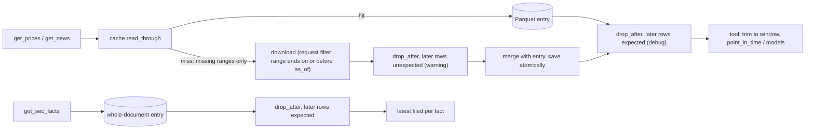

# M1 — Data layer, date guard, cache, calendar: plan

| | |
|---|---|
| **Status** | Draft, waiting for owner approval |
| **Date** | 2026-09-28 |
| **Specs** | [`specs.md`](specs.md) (approved 2026-09-28) |
| **ADRs** | [ADR-0003](../../adr/0003-point-in-time-prices.md) point-in-time prices (new) |

How M1 gets built. Requirement IDs (`FR-n`, `AC-n`) are M1's, from `specs.md`.

---

## 1. Files

| File | New or changed | Holds |
|---|---|---|
| `pyproject.toml`, `uv.lock` | changed | Dependencies (§6); mypy override for `pandas_market_calendars`; ruff lets `bullpit/clock.py` (only) use the banned wall-clock API |
| `bullpit/config.py`, `.env.example` | changed | `data_cache_dir`, `news_lookback_days`, `sec_max_requests_per_second` (FR-17) |
| `bullpit/clock.py` | new | `utc_now`, `Clock`, `LiveClock`, `SimClock` |
| `bullpit/data/calendar.py` | new | NYSE sessions and closes |
| `bullpit/data/guard.py` | new | `drop_after`, the response check |
| `bullpit/data/cache.py` | new | Parquet entries, the hit rule, `read_through` |
| `bullpit/data/prices.py` | new | yfinance and Alpaca downloads, raw reconstruction, `point_in_time`, `get_prices`, `get_market_context` |
| `bullpit/data/sec.py` | new | `sec_user_agent` (moved), pacing, ticker map, companyfacts, `get_sec_facts` |
| `bullpit/data/news.py` | new | `NewsArticle`, `get_news` |
| `bullpit/broker/clients.py` | changed | `DataClients` gains the corporate-actions client (read-only, same data host) |
| `bullpit/doctor.py` | changed | Imports `sec_user_agent` from `data/sec.py`; its own copy and `SEC_USER_AGENT_APP` are deleted |
| `tests/conftest.py` | changed | `settings` fixture (temp cache dir, fake keys, no `.env`) and `fixture_path()` |
| `tests/data/test_calendar.py`, `test_guard.py`, `test_prices.py`, `test_sec.py`, `test_news.py` | new | §7 |
| `tests/fixtures/{prices,sec,news}/` | new | Recorded responses, §8 |

No `market_context.py` (D-M1-6). No other files.

## 2. Data flow



Every path to a caller ends in `drop_after`, so the guard can't be skipped by a cache hit (FR-6). Prices and news share `read_through`. SEC can't filter its request by date, so it caches the whole document and filters on read.

## 3. Module design

### 3.1 `clock.py`

```python
def utc_now() -> datetime                 # the only wall-clock read in bullpit/ (ruff exemption for this file)
class Clock(Protocol):
    def as_of(self) -> date: ...
class LiveClock:
    def as_of(self) -> date:              # last_completed_session(utc_now())
class SimClock:
    def __init__(self, as_of: date) -> None   # ConfigError unless is_session(as_of)
```

`cache.py` also calls `utc_now()` for an entry's fetch time, which is metadata, not business time. That keeps the "only `clock.py` reads the clock" rule literally true.

### 3.2 `data/calendar.py`

- One cached (`lru_cache`) table of XNYS sessions and their UTC closes for 2000-01-01 to 2035-12-31, from `pandas_market_calendars`. A date outside that range raises `ConfigError`.
- `is_session(day)`, `session_close(day)` (raises `ConfigError` if not a session), `last_completed_session(moment)` (`moment` must be timezone-aware; binary search on closes), `lookback_start(as_of, sessions)` (the session `sessions - 1` places before `as_of`).
- Checked on 2026-09-28 with pandas 3.0.6 and pandas-market-calendars 5.4.0: 2024-03-08 closes 21:00 UTC and 2024-03-11 closes 20:00 UTC (DST); 2024-07-03 and 2024-11-29 close at 17:00 and 18:00 UTC; 2024-03-29 and 2024-11-28 aren't sessions.

### 3.3 `data/guard.py`

```python
def drop_after(frame: pd.DataFrame, column: str, as_of: date, *,
               later_rows_expected: bool, dataset: str, symbol: str) -> pd.DataFrame
```

- The limit comes from the column's type, which encodes FR-4 in one place: a **timezone-aware** column (news `created_at`) must be ≤ `session_close(as_of)`; a **date** column (bar date, `filed`, stored as naive `datetime64`) must be ≤ `as_of`.
- A column that isn't `datetime64`, or has any `NaT`, raises `LookaheadViolation` (FR-7).
- Each dropped row is logged: `lookahead_row_dropped` with `dataset`, `symbol`, `row_date`, `as_of`, at **warning** when `later_rows_expected` is false (a source ignored the request filter) and **debug** when it's true (cache reads, and SEC, which has no request filter) (FR-6).

The request filter (FR-5) lives in each download function, because only it knows its source's parameters. Every download gets an inclusive range `(a, b)` with `b ≤ as_of` (§3.4): yfinance `end = b + 1 day` (exclusive, checked); Alpaca bars `end = session_close(b)` (for prices, `b` is always a session: `as_of` or an entry's start, which comes from `lookback_start`); Alpaca corporate actions `end = b`; news `end = min(session_close(as_of), b + 1 day at 00:00 UTC)`, which never passes the cutoff and works when `b` isn't a session. The one exception is yfinance's split list (FR-5, ADR-0003).

### 3.4 `data/cache.py`

```python
@dataclass(frozen=True)
class CacheEntry:
    frame: pd.DataFrame
    start: date               # first date the entry covers
    complete_through: date    # every row up to this date is present

def load(dataset: str, symbol: str, *, settings: Settings) -> CacheEntry | None
def save(dataset: str, symbol: str, entry: CacheEntry, *, settings: Settings) -> None
def complete_through(end: date, fetched_at: datetime) -> date
def missing_ranges(entry: CacheEntry | None, start: date, as_of: date) -> list[tuple[date, date]]
def read_through(dataset: str, symbol: str, start: date, as_of: date, *,
                 fetch: Callable[[date, date], pd.DataFrame], key: list[str],
                 date_column: str, settings: Settings) -> pd.DataFrame
```

- **File:** `data_cache_dir / dataset / quote(symbol, safe="").parquet` (so `^VIX` becomes `%5EVIX`). `start` and `complete_through` go in the Parquet schema metadata (key `bullpit`), next to pandas' own. **Atomic write:** write `*.tmp`, then `Path.replace` (NFR-5).
- **Hit rule (FR-16, D-M1-4):** `complete_through(end, fetched_at) = min(end, last_completed_session(midnight New York on fetched_at's date))`. Data fetched on a later New York date than `as_of` is complete through `as_of`; a same-day fetch is complete only through the session before.
- **`missing_ranges`:** no entry, or a request that ends before the entry starts (`as_of < entry.start`), gives `[(start, as_of)]`, and the result **replaces** the entry. Merging there would mean fetching past `as_of`, or recording a gap as covered. Otherwise the ranges are `(start, entry.start)` if the request starts earlier, and `(entry.complete_through, as_of)` if it ends later. Every range ends on or before `as_of` (the request filter). Ranges are inclusive, so edges overlap and are de-duplicated on `key`. The entry stays one continuous window, so a weekly backtest fetches only each new week, and a resumed or repeated run reads everything from disk.
- **`read_through`:** it logs `cache_hit` or `cache_miss` (with the ranges). Each fetched piece goes through `drop_after(later_rows_expected=False)`. The pieces are merged with the entry, de-duplicated on `key` (the newest row wins) and saved with `start = min(start, entry.start)` and `complete_through = max(entry.complete_through, complete_through(as_of, utc_now()))`; a replaced entry uses the new values only. The result goes through `drop_after(later_rows_expected=True)`.

### 3.5 `data/prices.py`

```python
def _yahoo_symbol(symbol: str) -> str          # "BRK.B" -> "BRK-B"
def _download_yfinance(symbol: str, start: date, end: date, timeout: float) -> tuple[pd.DataFrame, pd.Series]
def _raw_from_yfinance(history: pd.DataFrame, splits: pd.Series) -> pd.DataFrame
def _download_alpaca(symbol: str, start: date, end: date, settings: Settings) -> tuple[pd.DataFrame, list[tuple[date, float]]]
def _raw_from_alpaca(bars: pd.DataFrame, splits: list[tuple[date, float]]) -> pd.DataFrame
def point_in_time(raw: pd.DataFrame, as_of: date) -> pd.DataFrame
```

- **Raw frame** (what the cache stores): `date` (naive `datetime64`, the session date), `open`, `high`, `low`, `close`, `volume`, `split_ratio`, `source`. Session dates come from each source's timestamps read in the exchange's local time, then `.tz_localize(None).normalize()`. yfinance's index is already local (New York; Chicago for `^VIX`). Alpaca stamps daily bars at New York midnight in UTC (04:00Z in summer, 05:00Z in winter; checked 2026-09-28), so they're converted to New York time first.
- **yfinance → raw (ADR-0003):** `history(start, end + 1 day, auto_adjust=False, actions=True, timeout=…)` and `Ticker.splits`. `factor(d)` is the product of the split ratios dated after `d` from the **full** split list; prices × factor, volume ÷ factor. `split_ratio` is the ratio on ex-dates, otherwise 1.0.
- **Alpaca → raw:** `StockBarsRequest(timeframe=Day, adjustment=RAW, feed=SIP, end=session_close(as_of))`, plus corporate actions (`FORWARD_SPLIT`, `REVERSE_SPLIT`, `end=as_of`), with ratio `new_rate / old_rate`.
- **`point_in_time`:** `f = split_ratio[::-1].cumprod()[::-1].shift(-1, fill_value=1.0)` over rows ≤ `as_of`; prices ÷ f, volume × f. For NVDA at `as_of` 2024-06-11, 2024-06-07 gives 1,208.88 ÷ 10 = 120.888, which matches Yahoo (AC-9).
- **`get_prices`:** `start = lookback_start(as_of, sessions)`, then `read_through("prices", symbol, …, key=["date"], date_column="date")`. The fetch tries yfinance; if yfinance raises or returns no rows, it tries Alpaca, unless the symbol starts with `^` (FR-10). If Alpaca raises, that becomes `DataUnavailable`; an empty result stays empty (a stock listed after `start` has no earlier bars). Rows before `start` are trimmed, then `point_in_time` runs. No rows at all raises `DataUnavailable`. `source` is `"alpaca"` if any returned row came from Alpaca. `bars` is indexed by `date` with the five price columns.
- **`get_market_context`:** `get_prices("SPY", …)` and `get_prices("^VIX", …)`.

### 3.6 `data/sec.py`

```python
def sec_user_agent(settings: Settings) -> str               # f"BullPit/{__version__} {email}"
def _get_json(url: str, *, settings: Settings) -> dict[str, Any]   # paced, UA header, timeout; 404 -> DataUnavailable
def get_cik(ticker: str, *, settings: Settings) -> int
def _flatten(companyfacts: dict[str, Any]) -> pd.DataFrame
def get_sec_facts(ticker: str, as_of: date, *, settings: Settings) -> SecFacts
```

- **Pacing (FR-13):** a module-level `time.monotonic()` stamp; each request sleeps until `1 / sec_max_requests_per_second` seconds have passed since the last one. Every request is logged with its URL (C12 hand check for AC-7).
- **`get_cik`:** `company_tickers.json` is cached as entry `sec/company_tickers` (columns `ticker`, `cik`; `start` and `complete_through` both set to `complete_through(date.max, utc_now())`, the session the map is current to). The ticker is upper-cased with `.` → `-`. A miss refetches once, then raises `DataUnavailable` (FR-11).
- **`_flatten`:** one row per fact: `taxonomy`, `tag`, `unit`, `start` (`NaT` for instant facts), `end`, `value` (float), `fy`, `fp`, `form`, `filed`, `accn`. AAPL's document is about 3.7 MB of JSON, so it's cached per CIK as Parquet.
- **`get_sec_facts`:** the entry `sec_facts/CIK##########` holds the whole document. It's a hit if `complete_through ≥ as_of`; otherwise it's refetched and saved with `complete_through(date.max, utc_now())`. Filtering: `drop_after("filed", later_rows_expected=True)` (the source has no request filter, so later facts are expected; FR-6). Then sort by (`filed`, `accn`) and keep the last row per (`taxonomy`, `tag`, `unit`, `start`, `end`) (FR-12).

### 3.7 `data/news.py`

```python
class NewsArticle(BaseModel, frozen=True): ...   # as in specs §5
def _download_news(symbol: str, start: datetime, end: datetime, settings: Settings) -> list[dict[str, Any]]
def _frame_from_news(records: list[dict[str, Any]]) -> pd.DataFrame
def get_news(symbol: str, as_of: date, *, settings: Settings) -> list[NewsArticle]
```

- `_download_news`: `NewsRequest(symbols=symbol, start=start, end=end, include_content=False)` with no `limit`, so the SDK reads every page (checked in alpaca-py 0.44's `_get_marketdata`). It returns `model_dump()` records.
- `get_news`: `window_start = session_close(as_of) - news_lookback_days`, then `read_through("news", symbol, window_start.date(), as_of, key=["id"], date_column="created_at")`. The fetch turns a range `(a, b)` into `start = a` at 00:00 UTC and `end = min(session_close(as_of), b + 1 day at 00:00 UTC)` (§3.3). It keeps rows with `created_at > window_start`, sorts by time, and returns models. No rows gives `[]`.

## 4. Error handling and logging

- Third-party exceptions are caught in the `_download_*` and `_get_json` functions and re-raised as `DataUnavailable(... ) from exc`, with a message naming the source and symbol, never a response body.
- The guard's `LookaheadViolation` and the calendar's `ConfigError` are never caught in `data/`.
- Log events: `cache_hit`, `cache_miss`, `price_source`, `sec_request`, `lookahead_row_dropped`. They're enough to do AC-4, AC-5 and AC-7 by hand from `logs/bullpit.log`.

## 5. Key decisions made in this plan

| # | Decision | Reason |
|---|---|---|
| P-1 | One `read_through` in `cache.py` runs both guard passes | The guard can't be forgotten by a new tool, and cache reads are always re-checked (dev-plan M1: "the guard runs after reading from the cache too") |
| P-2 | Cache entries grow as one continuous window; misses fetch only the missing edges | Backtests fetch each week once; resumed and repeat runs (M6, M7) get identical data from disk, so their LLM cache keys match |
| P-3 | The date limit is taken from the column's type (timezone-aware or date) | FR-4's table lives in one function, with no per-call flag to get wrong |
| P-4 | Download functions are thin and separate from pure parse functions; tests replace only the download functions (`monkeypatch`) | Recorded responses exercise the real parsing, point-in-time and guard code with no network, and with no abstraction layer for fakes |
| P-5 | Tools take `settings` as a keyword argument, and tests pass one with a temp cache dir | Explicit, and it keeps a developer's `.env` and real cache out of tests (as in M0) |
| P-6 | Symbols use Alpaca's form (`BRK.B`); yfinance and SEC get `-` | The request check (M3) validates tickers against Alpaca, so that's the canonical form |

## 6. Dependencies and tool config

| Package | Group | Why (checked on 2026-09-28) |
|---|---|---|
| `pandas` | runtime | Already installed through yfinance (3.0.6); declared because we import it |
| `pyarrow` | runtime | Parquet engine and schema metadata |
| `pandas-market-calendars` | runtime | D2; version 5.4.0 works with pandas 3.0.6 |
| `hypothesis` | dev | The property test for AC-1 (dev-plan §2.1) |
| `pandas-stubs` | dev | pandas ships no `py.typed`, so `bullpit.data` can't pass mypy `strict` without it |

mypy: `ignore_missing_imports` for `pandas_market_calendars` only (it's untyped). ruff: `"bullpit/clock.py" = ["TID251"]`.

## 7. Test plan

All tests use recorded fixtures or small synthetic frames. Downloads are patched, and `pytest-socket` blocks everything else (AC-8).

| AC | Test | What it does |
|---|---|---|
| AC-1 | `test_guard.py::test_no_row_after_cutoff` | Leaky fakes (rows 30 sessions either side of `as_of`, ignoring the request filter) for prices, news and SEC; `as_of` = 2024-06-07; asserts no returned row is after the cutoff |
| AC-1 | `test_guard.py::test_no_row_after_cutoff_property` | The same with hypothesis over random sessions in 2024–2025 (50 examples, a fresh temp cache per example) |
| AC-2 | `test_guard.py::test_drop_after` | Unit: a later row is dropped and a `lookahead_row_dropped` event is captured (`structlog.testing.capture_logs`); a `NaT` row raises `LookaheadViolation` |
| AC-2 | `test_guard.py::test_injected_cache_row_is_dropped` | `get_prices` fills the cache; a future row is appended to the Parquet file; a second call doesn't return it and logs it |
| AC-3 | `test_sec.py::test_point_in_time_facts` | A hand-built companyfacts: a fact ending 2024-03-30 filed 2024-05-03 is absent at `as_of` 2024-05-01 and present at 2024-05-03; a restated value appears only from its own filing date |
| AC-6 | `test_calendar.py::test_known_dates` | Parametrised: weekends, 2024-03-29, 2024-11-28, the two early closes, the DST pair, `last_completed_session` one minute before and after a close |
| AC-9 | `test_prices.py::test_point_in_time_split` | NVDA recorded from yfinance and from Alpaca: `as_of` 2024-06-07 gives close 1,208.88; `as_of` 2024-06-11 gives 120.888 for 2024-06-07; both sources agree to 0.01. No dividend adjustment: every yfinance-path close equals the recorded `Close` × its split factor, not `Adj Close` (NVDA's 2024-06-11 ex-dividend date is inside the window) |
| AC-10 | `test_prices.py::test_prices_and_market_context` | AAPL, SPY, `^VIX` recorded: expected session count, columns, index dates (VIX's Chicago timestamps mapped to the right sessions), `source` |
| AC-10 | `test_sec.py::test_parses_recorded_companyfacts` | AAPL trimmed companyfacts and ticker map: known revenue facts present; `BRK.B` resolves; a ticker missing from the map raises `DataUnavailable` |
| AC-10 | `test_news.py::test_parses_recorded_news` | AAPL recorded window: article count, UTC `created_at`, fields; an empty download gives `[]` |
| AC-4, 5, 7, 11 | by hand | §9 |
| AC-8 | the suite itself | `uv run pytest` green locally and in CI |

No tests for settings, `SimClock`/`LiveClock` wrappers, cache internals or logging (dev-plan §7.3, C12).

## 8. Fixtures

Recorded once from the real services with a throwaway script in the session scratchpad (not committed, per CLAUDE.md). The commands and date go in `task.md`. Total size should be under about 300 KB.

| Path | Content |
|---|---|
| `prices/aapl_yf.parquet`, `aapl_yf_splits.parquet` | AAPL yfinance history 2024-04-01..2024-07-31 and its split list |
| `prices/nvda_yf.parquet`, `nvda_yf_splits.parquet` | NVDA 2024-05-24..2024-06-21 |
| `prices/nvda_alpaca.parquet`, `nvda_alpaca_splits.json` | The same window from Alpaca (raw SIP) with corporate-action splits |
| `prices/spy_yf.parquet`, `vix_yf.parquet` | 2024-07-01..2024-07-31 |
| `sec/company_tickers.json` | Trimmed to AAPL, SPY, BRK-B |
| `sec/aapl_companyfacts.json` | Trimmed to two revenue tags and `dei` shares outstanding |
| `sec/restated.json` | Hand-built for AC-3 (clearer than hunting for a real restatement) |
| `news/aapl_news.json` | One recorded 7-day window of AAPL articles (no content field) |

gitleaks and a search for the SEC email run on the fixtures before they're committed.

## 9. Manual checks (evidence in `task.md`)

| AC | Check |
|---|---|
| AC-4 | `get_prices("AAPL", …)` twice for the same `as_of`: `cache_miss` then `cache_hit`, and no request log on the second call |
| AC-5 | Force yfinance to fail (patch `_download_yfinance` to raise, in a Python session): `source == "alpaca"`, and closes equal the yfinance run to 0.01 |
| AC-7 | `get_sec_facts` for three tickers with a cold cache: `sec_request` log lines show the User-Agent and gaps of at least 0.1 s |
| AC-11 | Each tool for AAPL at the latest session and at 2024-07-12; SPY and `^VIX`; `get_sec_facts("SPY")` and an unknown ticker raise `DataUnavailable`; an AAPL news week with more than 50 articles returns all of them |

## 10. Risks

| Risk | Mitigation |
|---|---|
| yfinance changes columns or `Ticker.splits` | Recorded fixtures pin today's shape; the Alpaca backup; AC-9 compares the two |
| pandas-stubs makes strict typing noisy | Keep pandas code in small functions; use `cast` only at the boundary of an untyped call |
| A split during a backtest trade (M6) | Raised in ADR-0003's consequences for the M6 specs |
| Alpaca calls have no timeout (NFR-4) | Calls are made by hand or in resumable runs; a hang is visible and the run resumes |
| SEC companyfacts is large (3.7 MB for AAPL) | Fetched once per CIK per day at most, stored as Parquet |
