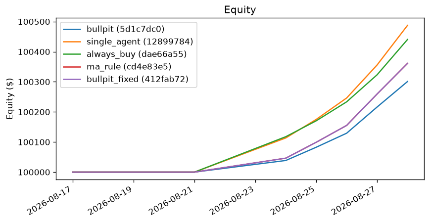
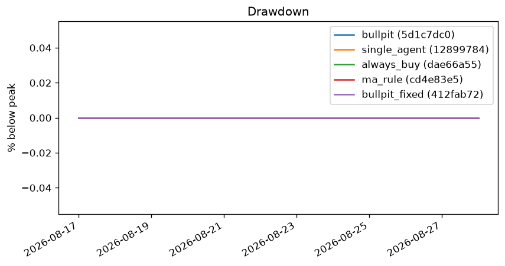
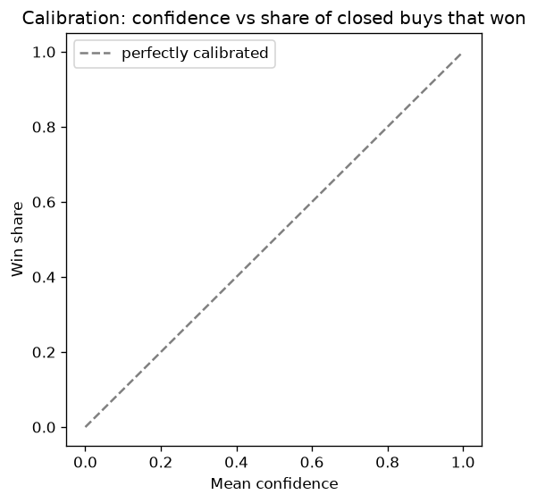

# Results

## Setup

- Stocks: BRK.B, MSFT
- Window: 2026-08-17 to 2026-08-28 (2 weeks, one decision on each week's last session)
- Starting cash: $100,000; the same broker, sizing limits, exits and slippage for every approach
- Runs: bullpit 5d1c7dc0 (commit 404e56d); single_agent 12899784 (commit 404e56d); always_buy dae66a55 (commit 404e56d); ma_rule cd4e83e5 (commit 404e56d); bullpit_fixed 412fab72 (commit 404e56d)
- Models of the AI approaches: {'small': 'qwen/qwen3.8-27b:free', 'large': 'qwen/qwen3.8-27b:free'} (a free OpenRouter model, not pinned)

## Results

| Approach | Run | Total return | Sharpe | Max drawdown | Win rate | Profit factor | Buy decisions | Trades entered (closed / open at end) | Open-at-end P&L | "No trade" value | Brier | Tokens per request |
|---|---|---|---|---|---|---|---|---|---|---|---|---|
| bullpit | 5d1c7dc0 | +0.30% | 5.10 | 0.00% | n/a | n/a | 2 | 1 (0 / 1) | 300.80 | 1 trades, P&L 79.44 (0 not sizeable) | n/a | 21,361 |
| single_agent | 12899784 | +0.49% | 5.10 | 0.00% | n/a | n/a | 4 | 2 (0 / 2) | 487.32 | 0 trades, P&L 0.00 (0 not sizeable) | n/a | 2,321 |
| always_buy | dae66a55 | +0.44% | 5.10 | 0.00% | n/a | n/a | 4 | 2 (0 / 2) | 440.40 | 0 trades, P&L 0.00 (0 not sizeable) | n/a | 0 |
| ma_rule | cd4e83e5 | +0.36% | 5.10 | 0.00% | n/a | n/a | 3 | 1 (0 / 1) | 360.96 | 1 trades, P&L 79.44 (0 not sizeable) | n/a | 0 |
| bullpit_fixed | 412fab72 | +0.36% | 5.10 | 0.00% | n/a | n/a | 2 | 1 (0 / 1) | 360.96 | 1 trades, P&L 79.44 (0 not sizeable) | n/a | 0 |
| buy and hold BRK.B | n/a | +0.06% | n/a | n/a | n/a | n/a | n/a | n/a | n/a | n/a | n/a | n/a |
| buy and hold MSFT | n/a | +4.72% | n/a | n/a | n/a | n/a | n/a | n/a | n/a | n/a | n/a | n/a |

## Comparison (total return only)

- bullpit 5d1c7dc0 (+0.30%) is below single_agent 12899784 (+0.49%).
- bullpit 5d1c7dc0 (+0.30%) is below always_buy dae66a55 (+0.44%).
- bullpit 5d1c7dc0 (+0.30%) is below ma_rule cd4e83e5 (+0.36%).
- bullpit 5d1c7dc0 (+0.30%) is below bullpit_fixed 412fab72 (+0.36%).
- single_agent 12899784 (+0.49%) is above always_buy dae66a55 (+0.44%).
- single_agent 12899784 (+0.49%) is above ma_rule cd4e83e5 (+0.36%).
- single_agent 12899784 (+0.49%) is above bullpit_fixed 412fab72 (+0.36%).
- always_buy dae66a55 (+0.44%) is above ma_rule cd4e83e5 (+0.36%).
- always_buy dae66a55 (+0.44%) is above bullpit_fixed 412fab72 (+0.36%).
- ma_rule cd4e83e5 (+0.36%) is equal to bullpit_fixed 412fab72 (+0.36%).
- bullpit 5d1c7dc0 (+0.30%) is above BRK.B buy and hold (+0.06%).
- bullpit 5d1c7dc0 (+0.30%) is below MSFT buy and hold (+4.72%).
- single_agent 12899784 (+0.49%) is above BRK.B buy and hold (+0.06%).
- single_agent 12899784 (+0.49%) is below MSFT buy and hold (+4.72%).
- always_buy dae66a55 (+0.44%) is above BRK.B buy and hold (+0.06%).
- always_buy dae66a55 (+0.44%) is below MSFT buy and hold (+4.72%).
- ma_rule cd4e83e5 (+0.36%) is above BRK.B buy and hold (+0.06%).
- ma_rule cd4e83e5 (+0.36%) is below MSFT buy and hold (+4.72%).
- bullpit_fixed 412fab72 (+0.36%) is above BRK.B buy and hold (+0.06%).
- bullpit_fixed 412fab72 (+0.36%) is below MSFT buy and hold (+4.72%).

A 2-week, 2-stock pilot can't tell skill from luck.

## Limits

- **Sample size.** 7 trades entered across all approaches, over 2 weeks and 2 stocks: far too little to separate skill from luck. Sharpe comes from only 2 weekly returns, so treat it as a formality.
- **One seed.** Each approach ran once. Repeat seeds need a provider that accepts a seed, and the free Qwen route does not. Repeats, the full-length run and the debate-impact measure are carried over.
- **Model.** The AI approaches used a free OpenRouter model, not the pinned gpt-oss models, so this says little about Bull Pit on the pinned pair.
- **Fills are approximate.** Simulated fills use the next open plus slippage and daily bars (ADR-0005).
- **Stocks.** They were chosen by a rule that favours large, surviving companies (ADR-0006).
- **Buy and hold** is fully invested; the approaches are mostly in cash, so their returns are not directly comparable.

## Why a pilot on a free model, and what comes next

Bull Pit is built to cost nothing to run, so this pilot uses the free `qwen/qwen3.8-27b:free` route on OpenRouter instead of a paid model. That route has limits that shaped the result: a small shared daily quota (about 50 requests), frequent "rate-limited upstream" pauses that made runs slow, no `seed` setting so runs can't be repeated exactly, no JSON mode, and it is not the pinned gpt-oss pair the system was designed around.

A complete test (26 weeks, several stocks, repeat seeds) needs about 300 requests or more, which the free tiers can't cover. Running it needs a model with paid credit, which goes against the free-of-cost rule, so it is left for later. The commands are in the M7 retrospective, and the same `bullpit eval` will then produce the full comparison.

What this pilot does show is that the pipeline works end to end: all five approaches ran on the same broker, stocks and dates, every metric was computed from the journal, and this page and its charts were produced by code. It does not show that any approach is better than another.
